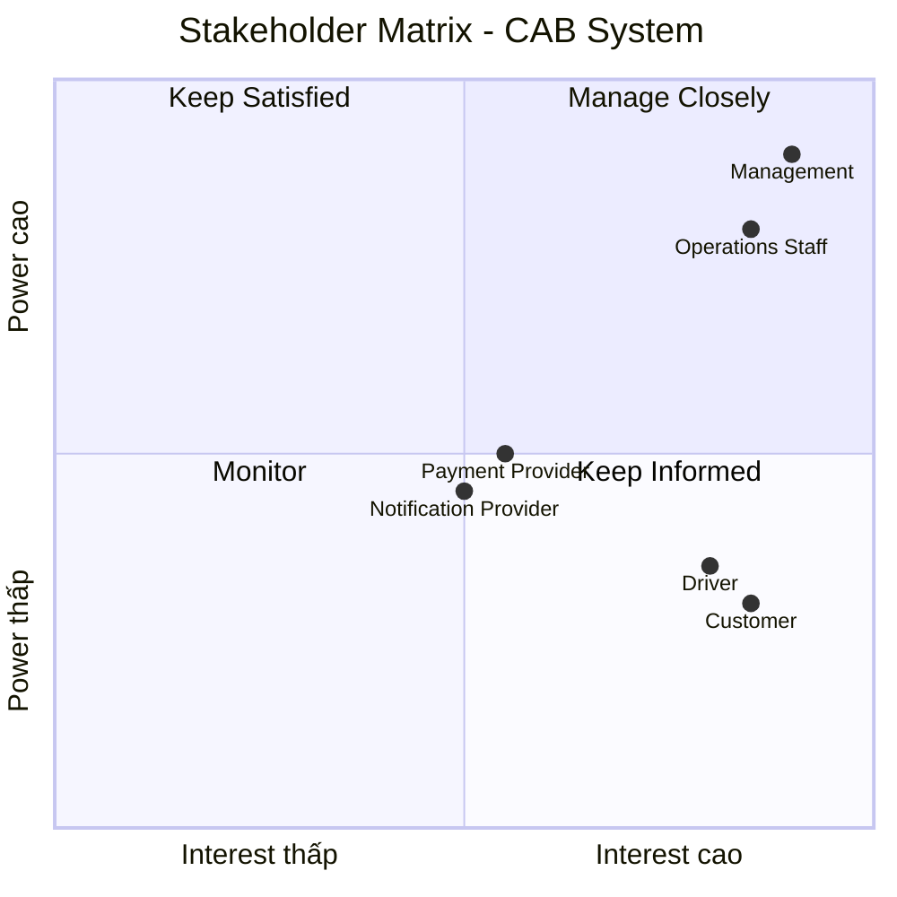
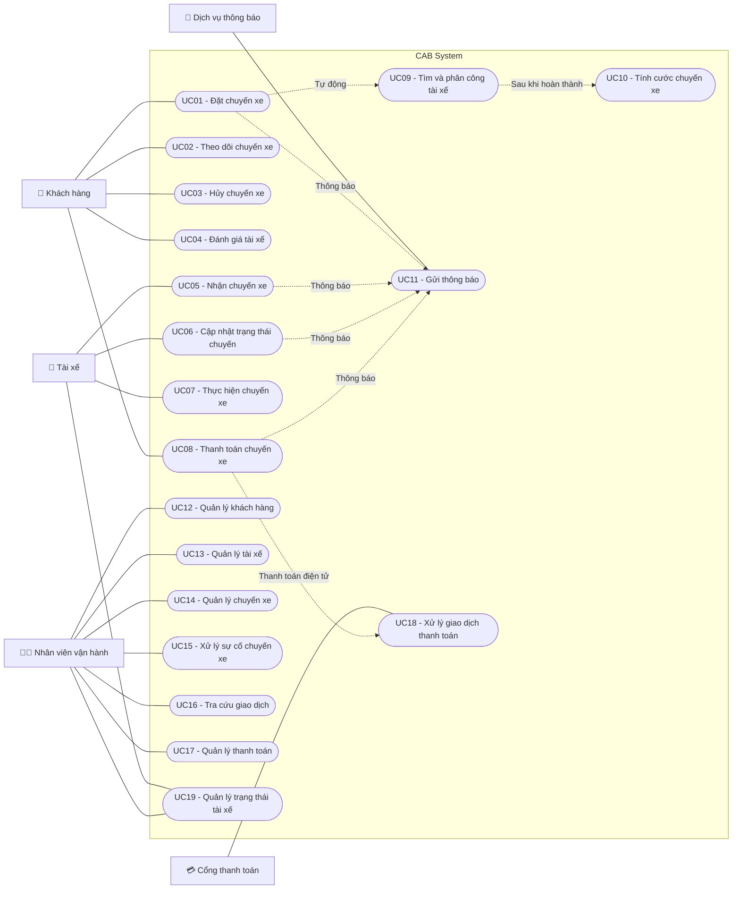

Bước 1: Đọc và phân tích yêu cầu của khách hàng ở giai đoạn sơ khởi - hiểu được business contact (ngữ cảnh của nghiệp vụ) và vấn đề của nghiệp vụ
# 1. Business Context – Ngữ cảnh nghiệp vụ

**CAB System** là nền tảng đặt xe trực tuyến của công ty **ABC**, kết nối **khách hàng – tài xế – nhân viên vận hành** trong toàn bộ quy trình đặt và thực hiện chuyến xe.

### Quy trình nghiệp vụ tổng quát

**Khách hàng tạo yêu cầu → Hệ thống tìm tài xế → Tài xế nhận chuyến → Thực hiện chuyến → Tính cước → Thanh toán → Đánh giá**

---

# 2. Business Problem – Vấn đề nghiệp vụ

Qua phân tích yêu cầu, có thể xác định các vấn đề nghiệp vụ hiện tại của công ty ABC như sau:

## Vấn đề 1: Phân công tài xế thủ công

Việc tìm kiếm và phân công tài xế hiện chủ yếu được thực hiện thủ công.

**Hậu quả:**

- Mất nhiều thời gian xử lý.
- Khó đáp ứng khi số lượng yêu cầu đặt xe tăng.
- Dễ xảy ra sai sót trong quá trình phân công.
- Khó tối ưu việc lựa chọn tài xế phù hợp.

## Vấn đề 2: Khách hàng khó theo dõi chuyến đi

Khách hàng chưa có khả năng theo dõi đầy đủ trạng thái của chuyến xe, bao gồm:

- Hệ thống đang tìm tài xế.
- Tài xế nào đã nhận chuyến.
- Tài xế đã đến điểm đón hay chưa.
- Chuyến xe đang ở trạng thái nào.
- Chuyến xe đã hoàn thành hay chưa.

**Hậu quả:**

- Khách hàng khó nắm bắt thông tin chuyến xe.
- Tăng số lượng yêu cầu hỗ trợ.
- Trải nghiệm khách hàng chưa tốt.

## Vấn đề 3: Thanh toán chưa được quản lý tập trung

Thông tin và trạng thái thanh toán chưa được quản lý thống nhất trên một hệ thống.

**Hậu quả:**

- Khó kiểm soát các giao dịch.
- Khó theo dõi doanh thu.
- Khó xử lý các giao dịch thanh toán thất bại.
- Khó tra cứu lịch sử thanh toán.

## Vấn đề 4: Khó mở rộng hệ thống

Hệ thống hiện tại khó đáp ứng khi số lượng khách hàng, tài xế và yêu cầu đặt xe tăng cao.

**Hậu quả:**

- Có nguy cơ giảm hiệu năng vào giờ cao điểm.
- Khó đáp ứng lượng truy cập lớn.
- Khó mở rộng tài nguyên khi nhu cầu tăng.

## Vấn đề 5: Khó quản lý vận hành

Nhân viên vận hành chưa có một hệ thống tập trung để quản lý và giám sát hoạt động của dịch vụ.

Hệ thống cần hỗ trợ:

- Theo dõi các chuyến xe đang diễn ra.
- Theo dõi trạng thái tài xế.
- Quản lý thông tin khách hàng.
- Quản lý thông tin tài xế.
- Xử lý các chuyến xe gặp lỗi.
- Tra cứu lịch sử chuyến xe.
- Tra cứu lịch sử giao dịch.

**Hậu quả:**

- Nhân viên vận hành mất nhiều thời gian xử lý.
- Khó giám sát toàn bộ hoạt động.
- Khó phát hiện và xử lý sự cố kịp thời.

## Vấn đề 6: Khả năng mở rộng chức năng còn hạn chế

Hệ thống hiện tại cần được thiết kế linh hoạt để đáp ứng các nhu cầu phát triển trong tương lai.

Doanh nghiệp có thể cần:

- Thêm các loại hình dịch vụ mới.
- Thêm các phương thức thanh toán mới.
- Thêm các nhà cung cấp dịch vụ thông báo.
- Thay đổi hoặc nâng cấp các thành phần kỹ thuật.
- Tích hợp thêm các dịch vụ bên ngoài.

**Hậu quả:**

- Việc thay đổi chức năng có thể mất nhiều thời gian.
- Chi phí bảo trì và phát triển hệ thống tăng.
- Khó tích hợp các dịch vụ mới trong tương lai.
## Tổng kết
Các vấn đề trên cho thấy công ty ABC cần xây dựng một **CAB System** có khả năng:
- Tự động hóa quá trình tìm kiếm và phân công tài xế.
- Cho phép khách hàng theo dõi trạng thái chuyến xe.
- Quản lý tập trung thông tin và giao dịch thanh toán.
- Hỗ trợ nhân viên vận hành giám sát toàn bộ hoạt động.
- Đảm bảo khả năng mở rộng khi số lượng người dùng tăng.
- Dễ dàng tích hợp thêm dịch vụ và công nghệ mới trong tương lai.

Bước 2: Xác định stakeholder lập bảng gồm 2 cột gồm tên và vai trò và vẽ ma trận stakeholder cho biêt tầm ảnh hưởng của stakeholder trên hệ thống (công cụ )
| Tên Stakeholder | Vai trò |
|---|---|
| Khách hàng | Đặt xe, theo dõi chuyến, thanh toán và đánh giá tài xế |
| Tài xế | Nhận chuyến, thực hiện chuyến và cập nhật trạng thái |
| Nhân viên vận hành | Quản lý, giám sát và hỗ trợ xử lý chuyến |
| Bộ phận kỹ thuật/IT | Quản lý, bảo trì và đảm bảo hệ thống hoạt động ổn định |
| Cổng thanh toán | Xử lý các giao dịch thanh toán điện tử |
| Dịch vụ thông báo | Gửi thông báo đến khách hàng và tài xế |

Bước 3: liệt kê các cái mục tiêu của nghiệp vụ (BG1 là gì BG2 là gì ) vd tự động tìm tài xế, hỗ trợ thanh toán mục đích cho phép thanh toán tiền mặt và thanh toán 
# 3. Business Goals – Mục tiêu nghiệp vụ

| Mã | Mục tiêu nghiệp vụ | Mục đích |
|---|---|---|
| **BG1** | Tự động tìm và phân công tài xế | Giảm thời gian tìm tài xế, giảm thao tác thủ công và đảm bảo yêu cầu được xử lý nhanh chóng |
| **BG2** | Theo dõi trạng thái chuyến xe | Cho phép khách hàng và nhân viên vận hành biết được tình trạng chuyến xe theo từng giai đoạn |
| **BG3** | Hỗ trợ nhiều phương thức thanh toán | Cho phép khách hàng thanh toán bằng tiền mặt hoặc thanh toán điện tử |
| **BG4** | Quản lý tập trung thông tin khách hàng và tài xế | Giúp nhân viên vận hành dễ dàng tra cứu, cập nhật và quản lý thông tin |
| **BG5** | Quản lý và giám sát chuyến xe | Cho phép nhân viên vận hành theo dõi, xử lý và kiểm soát các chuyến xe đang diễn ra |
| **BG6** | Tự động tính cước chuyến xe | Đảm bảo tiền cước được tính chính xác dựa trên thông tin chuyến xe |
| **BG7** | Gửi thông báo đến khách hàng và tài xế | Cung cấp thông tin kịp thời về trạng thái chuyến xe, thanh toán và các sự kiện liên quan |
| **BG8** | Quản lý lịch sử chuyến xe và giao dịch | Hỗ trợ tra cứu, kiểm soát và đối soát các chuyến xe và giao dịch đã phát sinh |
| **BG9** | Đảm bảo hệ thống hoạt động ổn định và có khả năng mở rộng | Đáp ứng số lượng khách hàng và tài xế tăng cao, đặc biệt trong giờ cao điểm |
| **BG10** | Hỗ trợ mở rộng và tích hợp dịch vụ | Cho phép doanh nghiệp dễ dàng thêm loại dịch vụ, phương thức thanh toán và nhà cung cấp bên ngoài |

Bước 4: Xác định phạm vi yêu cầu phải làm (score) vd quản lí khách hàng, tài xế trong mbb phải biết làm cái gì, liệt kê ra các thứ mình phải làm và những thứ ngoài phạm vi không nên làm 

# 4. Scope – Phạm vi yêu cầu

| Mã | Phạm vi | Trong phạm vi – Phải làm | Ngoài phạm vi – Không làm |
|---|---|---|---|
| **S1** | Quản lý khách hàng | Thêm, sửa, xem thông tin khách hàng; tìm kiếm khách hàng; xem lịch sử đặt xe; quản lý trạng thái tài khoản | Không quản lý thông tin tài khoản ngân hàng của khách hàng; không xử lý các dịch vụ ngoài hệ thống CAB |
| **S2** | Quản lý tài xế | Thêm, sửa, xem thông tin tài xế; quản lý trạng thái hoạt động; cập nhật trạng thái sẵn sàng/đang chạy; xem lịch sử chuyến | Không quản lý việc tuyển dụng, đào tạo hoặc tính lương tài xế |
| **S3** | Quản lý đặt xe | Tạo yêu cầu đặt xe; cập nhật/hủy yêu cầu; xác nhận thông tin chuyến; theo dõi trạng thái đặt xe | Không quản lý việc đặt phương tiện khác ngoài dịch vụ CAB |
| **S4** | Tìm kiếm và phân công tài xế | Tìm tài xế phù hợp; gửi yêu cầu nhận chuyến; xác nhận tài xế; cập nhật trạng thái phân công | Không tự động điều hành hoặc quản lý công việc cá nhân của tài xế |
| **S5** | Quản lý chuyến xe | Theo dõi chuyến; cập nhật trạng thái; bắt đầu/kết thúc chuyến; xử lý chuyến lỗi hoặc bị hủy | Không quản lý bảo dưỡng hoặc sửa chữa phương tiện |
| **S6** | Tính cước | Tính tiền dựa trên thông tin chuyến; áp dụng bảng giá; hiển thị số tiền cần thanh toán | Không xây dựng hệ thống kế toán hoặc quản lý toàn bộ tài chính doanh nghiệp |
| **S7** | Thanh toán | Hỗ trợ thanh toán tiền mặt và thanh toán điện tử; ghi nhận trạng thái thanh toán; lưu lịch sử giao dịch | Không trực tiếp xử lý tiền hoặc thay thế hệ thống của ngân hàng/cổng thanh toán |
| **S8** | Thông báo | Gửi thông báo về đặt xe, nhận chuyến, trạng thái chuyến và thanh toán | Không xây dựng hệ thống email/SMS riêng; chỉ tích hợp với nhà cung cấp dịch vụ |
| **S9** | Quản lý vận hành | Theo dõi chuyến xe; theo dõi tài xế; hỗ trợ xử lý sự cố; tra cứu lịch sử chuyến và giao dịch | Không quản lý hoạt động kinh doanh ngoài dịch vụ CAB |
| **S10** | Báo cáo và tra cứu | Tra cứu khách hàng, tài xế, chuyến xe, giao dịch; thống kê hoạt động cơ bản | Không xây dựng hệ thống BI/phân tích dữ liệu chuyên sâu |
| **S11** | Quản trị hệ thống | Quản lý tài khoản và phân quyền người dùng; cấu hình một số thông tin hệ thống | Không quản lý hạ tầng vật lý của trung tâm dữ liệu |
| **S12** | Tích hợp hệ thống | Tích hợp cổng thanh toán và dịch vụ thông báo | Không tự xây dựng ngân hàng, ví điện tử hoặc nhà cung cấp SMS |

Bước 5: Chuyển các yêu cầu thành bussiness requirment (mỗi bussiness requirment kí hiệu bằng BR01, BR01 là cái gì) vd br01 là đặt chuyến xe thì thiết kế bảng gồm mã, tên, diễn giải  

# 5. Business Requirements – Yêu cầu nghiệp vụ

| Mã | Tên | Diễn giải |
|---|---|---|
| **BR01** | Đặt chuyến xe | Hệ thống phải cho phép khách hàng tạo yêu cầu đặt chuyến bằng cách nhập điểm đón, điểm đến, thời gian và các thông tin cần thiết. |
| **BR02** | Quản lý yêu cầu đặt xe | Hệ thống phải cho phép khách hàng xem, cập nhật hoặc hủy yêu cầu đặt xe theo trạng thái của chuyến. |
| **BR03** | Tự động tìm tài xế | Hệ thống phải tự động tìm kiếm tài xế phù hợp dựa trên vị trí, trạng thái hoạt động và khả năng nhận chuyến. |
| **BR04** | Phân công tài xế | Hệ thống phải ghi nhận và xác nhận tài xế được phân công cho chuyến xe. |
| **BR05** | Quản lý tài xế | Hệ thống phải cho phép nhân viên vận hành quản lý thông tin và trạng thái hoạt động của tài xế. |
| **BR06** | Quản lý khách hàng | Hệ thống phải cho phép nhân viên vận hành quản lý thông tin, trạng thái tài khoản và lịch sử đặt xe của khách hàng. |
| **BR07** | Theo dõi trạng thái chuyến xe | Hệ thống phải cho phép khách hàng và nhân viên vận hành theo dõi trạng thái chuyến xe từ lúc đặt đến khi hoàn thành hoặc hủy. |
| **BR08** | Thực hiện chuyến xe | Hệ thống phải cho phép tài xế cập nhật các trạng thái của chuyến như đã nhận chuyến, đã đến điểm đón, đang thực hiện và hoàn thành. |
| **BR09** | Tính cước chuyến xe | Hệ thống phải tự động tính tiền cước dựa trên thông tin và quy định giá của chuyến xe. |
| **BR10** | Thanh toán chuyến xe | Hệ thống phải hỗ trợ khách hàng thanh toán bằng tiền mặt hoặc các phương thức thanh toán điện tử. |
| **BR11** | Quản lý giao dịch thanh toán | Hệ thống phải ghi nhận trạng thái và lưu lịch sử các giao dịch thanh toán để phục vụ tra cứu và đối soát. |
| **BR12** | Gửi thông báo | Hệ thống phải gửi thông báo đến khách hàng và tài xế khi có các sự kiện như đặt xe, nhận chuyến, thay đổi trạng thái hoặc thanh toán. |
| **BR13** | Quản lý và giám sát vận hành | Hệ thống phải cung cấp chức năng để nhân viên vận hành theo dõi chuyến xe, tài xế và xử lý các chuyến gặp sự cố. |
| **BR14** | Quản lý lịch sử | Hệ thống phải lưu trữ và cho phép tra cứu lịch sử chuyến xe, khách hàng, tài xế và giao dịch. |
| **BR15** | Đánh giá tài xế | Hệ thống phải cho phép khách hàng đánh giá tài xế sau khi chuyến xe hoàn thành. |
| **BR16** | Quản lý tài khoản và phân quyền | Hệ thống phải cho phép quản lý tài khoản người dùng và phân quyền truy cập theo từng vai trò. |
| **BR17** | Tích hợp dịch vụ bên ngoài | Hệ thống phải hỗ trợ tích hợp với cổng thanh toán và các dịch vụ thông báo bên ngoài. |
| **BR18** | Khả năng mở rộng hệ thống | Hệ thống phải được thiết kế để có thể mở rộng số lượng người dùng, tài xế, dịch vụ và các phương thức thanh toán trong tương lai. |
Bước 6: Xây dựng các bussiness process 
# 6. Business Process – Quy trình nghiệp vụ

| Mã | Business Process | Tác nhân | Mô tả quy trình |
|---|---|---|---|
| **BP01** | Đặt chuyến xe | Khách hàng | Nhập điểm đón, điểm đến và thời gian đón → kiểm tra thông tin → xác nhận đặt xe → hệ thống tạo yêu cầu và chuyển sang tìm tài xế. |
| **BP02** | Tìm và phân công tài xế | Hệ thống, Tài xế | Hệ thống tìm tài xế phù hợp → gửi yêu cầu nhận chuyến → nếu tài xế nhận thì xác nhận tài xế và thông báo cho khách hàng → nếu tài xế từ chối hoặc không phản hồi thì tìm tài xế khác → nếu không còn tài xế phù hợp thì thông báo cho khách hàng. |
| **BP03** | Thực hiện chuyến xe | Tài xế | Tài xế nhận chuyến → di chuyển đến điểm đón → cập nhật đã đến → đón khách → bắt đầu chuyến → thực hiện chuyến → cập nhật hoàn thành. |
| **BP04** | Tính cước chuyến xe | Hệ thống | Chuyến hoàn thành → hệ thống lấy thông tin chuyến → áp dụng bảng giá → tính cước → lưu và hiển thị số tiền cần thanh toán. |
| **BP05** | Thanh toán chuyến xe | Khách hàng, Tài xế, Cổng thanh toán | Khách hàng chọn phương thức thanh toán → tiền mặt: thanh toán cho tài xế và tài xế xác nhận → điện tử: gửi giao dịch đến cổng thanh toán và nhận kết quả → cập nhật trạng thái thanh toán. |
| **BP06** | Theo dõi chuyến xe | Khách hàng, Nhân viên vận hành | Xem thông tin chuyến → hệ thống cập nhật trạng thái → hiển thị tài xế và trạng thái chuyến → theo dõi đến khi hoàn thành hoặc hủy. |
| **BP07** | Gửi thông báo | Hệ thống, Dịch vụ thông báo | Phát sinh sự kiện → xác định người nhận → tạo và gửi thông báo → ghi nhận trạng thái gửi. |
| **BP08** | Đánh giá tài xế | Khách hàng | Chuyến hoàn thành → khách hàng đánh giá và nhận xét tài xế → gửi đánh giá → hệ thống lưu kết quả. |
| **BP09** | Quản lý vận hành | Nhân viên vận hành | Theo dõi chuyến và tài xế → phát hiện sự cố → xử lý hoặc hỗ trợ → cập nhật kết quả → lưu lịch sử xử lý. |
| **BP10** | Quản lý khách hàng và tài xế | Nhân viên vận hành | Tìm kiếm → xem thông tin → thêm/cập nhật thông tin → quản lý trạng thái → tra cứu lịch sử. |
# 7. Functional Requirements – Phân rã yêu cầu nghiệp vụ

| Mã BR | Business Requirement | Mã FR | Functional Requirement |
|---|---|---|---|
| **BR01** | Đặt chuyến xe | **FR01** | Nhập điểm đón |
|  |  | **FR02** | Nhập điểm đến |
|  |  | **FR03** | Chọn thời gian đón |
|  |  | **FR04** | Xác nhận đặt chuyến |
|  |  | **FR05** | Tạo yêu cầu đặt chuyến |
| **BR02** | Quản lý yêu cầu đặt xe | **FR01** | Xem thông tin chuyến |
|  |  | **FR02** | Xem trạng thái yêu cầu đặt xe |
|  |  | **FR03** | Hủy yêu cầu đặt xe |
| **BR03** | Tự động tìm tài xế | **FR01** | Tìm tài xế phù hợp |
|  |  | **FR02** | Lọc tài xế đang online/sẵn sàng |
|  |  | **FR03** | Ưu tiên tài xế có đánh giá cao |
|  |  | **FR04** | Gửi yêu cầu nhận chuyến cho tài xế |
|  |  | **FR05** | Xử lý trường hợp tài xế nhận chuyến |
|  |  | **FR06** | Xử lý trường hợp tài xế từ chối hoặc không phản hồi |
|  |  | **FR07** | Tìm tài xế khác khi tài xế không nhận |
|  |  | **FR08** | Thông báo khi không tìm được tài xế |
| **BR04** | Phân công tài xế | **FR01** | Xác nhận tài xế nhận chuyến |
|  |  | **FR02** | Cập nhật thông tin tài xế cho khách hàng |
| **BR05** | Quản lý tài xế | **FR01** | Thêm tài xế |
|  |  | **FR02** | Cập nhật thông tin tài xế |
|  |  | **FR03** | Xem thông tin tài xế |
|  |  | **FR04** | Cập nhật trạng thái tài xế |
|  |  | **FR05** | Xem lịch sử chuyến của tài xế |
| **BR06** | Quản lý khách hàng | **FR01** | Thêm khách hàng |
|  |  | **FR02** | Cập nhật thông tin khách hàng |
|  |  | **FR03** | Xem thông tin khách hàng |
|  |  | **FR04** | Tìm kiếm khách hàng |
|  |  | **FR05** | Xem lịch sử đặt xe của khách hàng |
| **BR07** | Theo dõi trạng thái chuyến xe | **FR01** | Cập nhật trạng thái chuyến |
|  |  | **FR02** | Xem trạng thái chuyến |
|  |  | **FR03** | Xem thông tin tài xế |
| **BR08** | Thực hiện chuyến xe | **FR01** | Cập nhật đã đến điểm đón |
|  |  | **FR02** | Bắt đầu chuyến |
|  |  | **FR03** | Kết thúc chuyến |
| **BR09** | Tính cước chuyến xe | **FR01** | Tính cước chuyến xe |
|  |  | **FR02** | Hiển thị số tiền cần thanh toán |
| **BR10** | Thanh toán chuyến xe | **FR01** | Chọn phương thức thanh toán |
|  |  | **FR02** | Thanh toán tiền mặt |
|  |  | **FR03** | Thanh toán điện tử |
|  |  | **FR04** | Xử lý kết quả thanh toán |
| **BR11** | Quản lý giao dịch thanh toán | **FR01** | Xem trạng thái giao dịch |
|  |  | **FR02** | Tra cứu lịch sử giao dịch |
| **BR12** | Gửi thông báo | **FR01** | Gửi thông báo đặt xe |
|  |  | **FR02** | Gửi thông báo nhận chuyến |
|  |  | **FR03** | Gửi thông báo thay đổi trạng thái chuyến |
|  |  | **FR04** | Gửi thông báo thanh toán |
| **BR15** | Đánh giá tài xế | **FR01** | Đánh giá tài xế |
|  |  | **FR02** | Nhập nhận xét về tài xế |
|  |  | **FR03** | Lưu kết quả đánh giá |
# 8. Business Rules & Exceptions – Quy tắc và ngoại lệ nghiệp vụ

## 8.1. Business Rules – Quy tắc nghiệp vụ

| Mã | Business Rule | Diễn giải |
|---|---|---|
| **BRL01** | Chỉ tài xế Available mới được nhận chuyến | Tài xế phải ở trạng thái `Available` mới được hệ thống gửi yêu cầu và cho phép nhận chuyến. |
| **BRL02** | Một tài xế chỉ được nhận một chuyến tại một thời điểm | Tài xế đang thực hiện chuyến không được nhận thêm chuyến mới. |
| **BRL03** | Chuyến phải có tài xế mới được thực hiện | Hệ thống chỉ cho phép bắt đầu chuyến khi đã xác định tài xế. |
| **BRL04** | Chỉ chuyến đã hoàn thành mới được tính cước | Hệ thống thực hiện tính cước sau khi tài xế cập nhật chuyến hoàn thành. |
| **BRL05** | Chỉ chuyến hợp lệ mới được thanh toán | Hệ thống chỉ cho phép thanh toán đối với chuyến có cước phí hợp lệ. |
| **BRL06** | Chỉ được đánh giá sau khi chuyến hoàn thành | Khách hàng chỉ có thể đánh giá tài xế sau khi chuyến kết thúc. |
| **BRL07** | Tài xế từ chối chuyến sẽ không được phân công chuyến đó | Hệ thống chuyển sang tìm tài xế phù hợp khác. |
| **BRL08** | Mỗi chuyến chỉ được phân công một tài xế | Khi một tài xế đã nhận chuyến, hệ thống không tiếp tục phân công chuyến đó cho tài xế khác. |
| **BRL09** | Thanh toán điện tử phải được xác nhận từ cổng thanh toán | Hệ thống chỉ ghi nhận thanh toán thành công khi nhận được kết quả thành công từ cổng thanh toán. |
| **BRL10** | Tài xế phải cập nhật trạng thái theo quá trình thực hiện chuyến | Tài xế phải cập nhật các trạng thái như đã đến điểm đón, bắt đầu và hoàn thành chuyến. |

## 8.2. Exceptions – Ngoại lệ

| Mã | Exception | Cách xử lý |
|---|---|---|
| **EX01** | Không tìm được tài xế | Hệ thống tiếp tục tìm tài xế trong thời gian quy định; nếu vẫn không có thì thông báo cho khách hàng và cho phép hủy yêu cầu. |
| **EX02** | Khách hàng chờ quá lâu nhưng chưa có tài xế | Hệ thống gửi thông báo cho khách hàng về tình trạng tìm tài xế và cho phép khách hàng hủy yêu cầu. |
| **EX03** | Tài xế từ chối chuyến | Hệ thống ghi nhận từ chối và tìm tài xế phù hợp khác. |
| **EX04** | Tài xế không phản hồi | Sau thời gian chờ quy định, hệ thống chuyển yêu cầu cho tài xế khác. |
| **EX05** | Thanh toán điện tử thất bại | Hệ thống thông báo thanh toán thất bại và cho phép khách hàng thực hiện lại hoặc chọn phương thức khác. |
| **EX06** | Khách hàng hủy chuyến | Hệ thống kiểm tra trạng thái chuyến → hủy chuyến → cập nhật trạng thái và thông báo cho tài xế nếu đã được phân công. |
| **EX07** | Tài xế gặp sự cố trong chuyến | Tài xế báo sự cố → hệ thống thông báo cho nhân viên vận hành → nhân viên xử lý và cập nhật kết quả. |
| **EX08** | Hệ thống không gửi được thông báo | Hệ thống ghi nhận lỗi và thực hiện gửi lại theo cơ chế của hệ thống. |
| **EX09** | Cổng thanh toán không phản hồi | Hệ thống ghi nhận giao dịch đang chờ xử lý và không xác nhận thanh toán thành công khi chưa có kết quả. |
| **EX10** | Tài xế không thể tiếp tục chuyến | Nhân viên vận hành tiếp nhận sự cố và thực hiện phương án xử lý phù hợp. |
# 9. Data Modeling – Mô hình dữ liệu

## 9.1. Xác định thực thể

| STT | Tên thực thể | Mô tả |
|---|---|---|
| 1 | **Customer** | Lưu thông tin khách hàng. |
| 2 | **Driver** | Lưu thông tin tài xế. |
| 3 | **Trip** | Lưu thông tin chuyến xe. |
| 4 | **DriverAssignment** | Lưu thông tin phân công và phản hồi của tài xế đối với chuyến xe. |
| 5 | **Payment** | Lưu thông tin thanh toán của chuyến xe. |
| 6 | **DriverReview** | Lưu đánh giá của khách hàng dành cho tài xế. |
| 7 | **Notification** | Lưu thông báo gửi đến khách hàng và tài xế. |
| 8 | **DriverStatus** | Lưu lịch sử trạng thái hoạt động của tài xế. |

## 9.2. Thuộc tính của các thực thể

| Thực thể | Thuộc tính |
|---|---|
| **Customer** | customer_id (PK), full_name, phone, email |
| **Driver** | driver_id (PK), full_name, phone, license_number, rating |
| **Trip** | trip_id (PK), customer_id (FK), pickup_location, destination, pickup_time, status, fare, created_at |
| **DriverAssignment** | assignment_id (PK), trip_id (FK), driver_id (FK), status, assigned_at, responded_at |
| **Payment** | payment_id (PK), trip_id (FK), amount, payment_method, payment_status, paid_at |
| **DriverReview** | review_id (PK), trip_id (FK), customer_id (FK), driver_id (FK), rating, comment, created_at |
| **Notification** | notification_id (PK), customer_id (FK), driver_id (FK), title, content, status, created_at |
| **DriverStatus** | status_id (PK), driver_id (FK), status, start_time, end_time |

## 9.3. Quan hệ giữa các thực thể

| STT | Thực thể 1 | Quan hệ | Thực thể 2 |
|---|---|---|---|
| 1 | Customer | Đặt | Trip |
| 2 | Trip | Được phân công | DriverAssignment |
| 3 | Driver | Nhận | DriverAssignment |
| 4 | Trip | Có | Payment |
| 5 | Customer | Đánh giá | DriverReview |
| 6 | Driver | Được đánh giá | DriverReview |
| 7 | Trip | Có | DriverReview |
| 8 | Customer | Nhận | Notification |
| 9 | Driver | Nhận | Notification |
| 10 | Driver | Có | DriverStatus |

Sơ đồ 
***

Bước 10: Xác định các yêu cầu phi chức năng 
## Yêu cầu phi chức năng

| Mã | Nhóm | Yêu cầu phi chức năng |
|---|---|---|
| NFR-01 | Tính ổn định | Hệ thống phải hoạt động ổn định vào các thời điểm nhu cầu đặt xe tăng cao. |
| NFR-02 | Cô lập lỗi | Lỗi xảy ra ở chức năng thanh toán hoặc thông báo không được làm cho toàn bộ hệ thống đặt xe ngừng hoạt động. |
| NFR-03 | Khả năng mở rộng | Các thành phần của hệ thống cần có khả năng mở rộng độc lập khi số lượng người dùng và yêu cầu tăng. |
| NFR-04 | Khả năng triển khai | Các chức năng mới có thể được triển khai từng phần và hạn chế ảnh hưởng đến các chức năng đang hoạt động. |
| NFR-05 | Xác thực | Khách hàng và tài xế phải được xác thực trước khi sử dụng các chức năng yêu cầu tài khoản. |
| NFR-06 | Phân quyền | Các thao tác quản trị phải được kiểm soát quyền truy cập theo vai trò người dùng. |
| NFR-07 | Bảo vệ dữ liệu | Thông tin cá nhân, thông tin phương tiện, dữ liệu vị trí và dữ liệu giao dịch phải được bảo vệ. |
| NFR-08 | Theo dõi và lưu vết | Hệ thống phải lưu vết các thao tác quan trọng để phục vụ kiểm tra và xử lý khi có sự cố. |
| NFR-09 | Khả năng mở rộng chức năng | Kiến trúc phải đủ linh hoạt để có thể bổ sung các loại dịch vụ mới trong tương lai. |
| NFR-10 | Mở rộng thanh toán | Có thể thêm các phương thức thanh toán mới mà không phải xây dựng lại toàn bộ hệ thống. |
| NFR-11 | Mở rộng thông báo | Có thể thêm nhà cung cấp dịch vụ thông báo mới mà không phải thay đổi toàn bộ hệ thống. |
| NFR-12 | Linh hoạt công nghệ | Có thể thay đổi một số thành phần kỹ thuật mà không phải xây dựng lại toàn bộ hệ thống. |
| NFR-13 | Kiến trúc hệ thống | Hệ thống nên được thiết kế theo kiến trúc cho phép các thành phần như đặt xe, thanh toán và thông báo hoạt động và mở rộng độc lập. |
Bước 11: vẽ và xác định các usecase(vd UC01 tên là customer ) xác định xem có bao nhiêu usecase 
# 11. Use Case – Xác định các Use Case

| Mã | Tên Use Case | Tác nhân chính |
|---|---|---|
| **UC01** | Đặt chuyến xe | Khách hàng |
| **UC02** | Theo dõi chuyến xe | Khách hàng |
| **UC03** | Hủy chuyến xe | Khách hàng |
| **UC04** | Đánh giá tài xế | Khách hàng |
| **UC05** | Nhận chuyến xe | Tài xế |
| **UC06** | Cập nhật trạng thái chuyến | Tài xế |
| **UC07** | Thực hiện chuyến xe | Tài xế |
| **UC08** | Thanh toán chuyến xe | Khách hàng |
| **UC09** | Tìm và phân công tài xế | Hệ thống |
| **UC10** | Tính cước chuyến xe | Hệ thống |
| **UC11** | Gửi thông báo | Hệ thống |
| **UC12** | Quản lý khách hàng | Nhân viên vận hành |
| **UC13** | Quản lý tài xế | Nhân viên vận hành |
| **UC14** | Quản lý chuyến xe | Nhân viên vận hành |
| **UC15** | Xử lý sự cố chuyến xe | Nhân viên vận hành |
| **UC16** | Tra cứu giao dịch | Nhân viên vận hành |
| **UC17** | Quản lý thanh toán | Nhân viên vận hành |
| **UC18** | Xử lý giao dịch thanh toán | Cổng thanh toán |
| **UC19** | Gửi thông báo | Dịch vụ thông báo |
| **UC20** | Quản lý trạng thái tài xế | Tài xế, Nhân viên vận hành |

## 11.1. Actors

| Mã | Actor | Vai trò |
|---|---|---|
| **A01** | Khách hàng | Đặt xe, theo dõi chuyến, thanh toán và đánh giá tài xế. |
| **A02** | Tài xế | Nhận chuyến, thực hiện chuyến và cập nhật trạng thái. |
| **A03** | Nhân viên vận hành | Quản lý và giám sát chuyến, khách hàng, tài xế và xử lý sự cố. |
| **A04** | Cổng thanh toán | Xử lý giao dịch thanh toán điện tử. |
| **A05** | Dịch vụ thông báo | Gửi thông báo đến khách hàng và tài xế. |

## 11. Use Case Diagram

Bước 12: đặc tả usecase 
# 12. Đặc tả Use Case

## UC01 – Đặt chuyến xe

| Thành phần | Nội dung |
|---|---|
| **Mã Use Case** | UC01 |
| **Tên Use Case** | Đặt chuyến xe |
| **Tác nhân** | Khách hàng |
| **Mục đích** | Cho phép khách hàng tạo yêu cầu đặt chuyến xe. |
| **Điều kiện trước** | Khách hàng đã đăng nhập và hệ thống đang hoạt động. |
| **Điều kiện sau** | Yêu cầu đặt chuyến được tạo và chuyển sang bước tìm tài xế. |
| **Luồng chính** | 1. Khách hàng nhập điểm đón. 2. Khách hàng nhập điểm đến. 3. Khách hàng chọn thời gian đón. 4. Hệ thống kiểm tra thông tin. 5. Khách hàng xác nhận đặt chuyến. 6. Hệ thống tạo yêu cầu đặt chuyến. 7. Hệ thống chuyển yêu cầu sang chức năng tìm tài xế. |
| **Luồng ngoại lệ** | Nếu thông tin không hợp lệ → hệ thống yêu cầu khách hàng nhập lại. Nếu hệ thống không thể tạo yêu cầu → thông báo lỗi cho khách hàng. |

## UC02 – Theo dõi chuyến xe

| Thành phần | Nội dung |
|---|---|
| **Mã Use Case** | UC02 |
| **Tên Use Case** | Theo dõi chuyến xe |
| **Tác nhân** | Khách hàng |
| **Mục đích** | Cho phép khách hàng theo dõi trạng thái chuyến và thông tin tài xế. |
| **Điều kiện trước** | Khách hàng có chuyến xe đang hoạt động. |
| **Điều kiện sau** | Thông tin và trạng thái chuyến được hiển thị. |
| **Luồng chính** | 1. Khách hàng mở chuyến xe. 2. Hệ thống lấy thông tin chuyến. 3. Hệ thống hiển thị trạng thái chuyến. 4. Nếu đã có tài xế, hệ thống hiển thị thông tin tài xế. 5. Hệ thống cập nhật trạng thái trong quá trình thực hiện chuyến. |
| **Luồng ngoại lệ** | Nếu không có thông tin chuyến → thông báo không tìm thấy chuyến. Nếu không có tài xế → hiển thị trạng thái đang tìm tài xế. |
## UC03 – Hủy chuyến xe

| Thành phần | Nội dung |
|---|---|
| **Mã Use Case** | UC03 |
| **Tên Use Case** | Hủy chuyến xe |
| **Tác nhân** | Khách hàng |
| **Mục đích** | Cho phép khách hàng hủy chuyến theo điều kiện nghiệp vụ. |
| **Điều kiện trước** | Chuyến xe đang ở trạng thái có thể hủy. |
| **Điều kiện sau** | Chuyến xe được cập nhật trạng thái hủy. |
| **Luồng chính** | 1. Khách hàng chọn chuyến cần hủy. 2. Hệ thống kiểm tra trạng thái chuyến. 3. Khách hàng xác nhận hủy. 4. Hệ thống cập nhật chuyến thành đã hủy. 5. Hệ thống thông báo kết quả. |
| **Luồng ngoại lệ** | Nếu chuyến không thể hủy → hệ thống thông báo và không thực hiện hủy. |
## UC04 – Đánh giá tài xế

| Thành phần | Nội dung |
|---|---|
| **Mã Use Case** | UC04 |
| **Tên Use Case** | Đánh giá tài xế |
| **Tác nhân** | Khách hàng |
| **Mục đích** | Cho phép khách hàng đánh giá tài xế sau chuyến đi. |
| **Điều kiện trước** | Chuyến xe đã hoàn thành. |
| **Điều kiện sau** | Đánh giá được lưu vào hệ thống. |
| **Luồng chính** | 1. Khách hàng mở chuyến đã hoàn thành. 2. Chọn chức năng đánh giá. 3. Chọn mức điểm đánh giá. 4. Nhập nhận xét nếu có. 5. Gửi đánh giá. 6. Hệ thống lưu đánh giá. |
| **Luồng ngoại lệ** | Nếu chuyến chưa hoàn thành → không cho phép đánh giá. Nếu đánh giá không hợp lệ → yêu cầu nhập lại. |

## UC05 – Nhận chuyến xe

| Thành phần | Nội dung |
|---|---|
| **Mã Use Case** | UC05 |
| **Tên Use Case** | Nhận chuyến xe |
| **Tác nhân** | Tài xế |
| **Mục đích** | Cho phép tài xế nhận chuyến được hệ thống phân công. |
| **Điều kiện trước** | Tài xế đang ở trạng thái Available và có yêu cầu chuyến. |
| **Điều kiện sau** | Chuyến được phân công cho tài xế. |
| **Luồng chính** | 1. Tài xế nhận yêu cầu chuyến. 2. Xem thông tin chuyến. 3. Chọn nhận chuyến. 4. Hệ thống kiểm tra trạng thái tài xế. 5. Hệ thống xác nhận tài xế nhận chuyến. 6. Thông báo cho khách hàng. |
| **Luồng ngoại lệ** | Nếu tài xế đã nhận chuyến khác → không cho phép nhận. Nếu chuyến đã được tài xế khác nhận → thông báo chuyến không còn khả dụng. |

## UC06 – Cập nhật trạng thái chuyến

| Thành phần | Nội dung |
|---|---|
| **Mã Use Case** | UC06 |
| **Tên Use Case** | Cập nhật trạng thái chuyến |
| **Tác nhân** | Tài xế |
| **Mục đích** | Cho phép tài xế cập nhật trạng thái trong quá trình thực hiện chuyến. |
| **Điều kiện trước** | Tài xế đã được phân công chuyến. |
| **Điều kiện sau** | Trạng thái chuyến được cập nhật. |
| **Luồng chính** | 1. Tài xế mở chuyến. 2. Cập nhật đã đến điểm đón. 3. Bắt đầu chuyến. 4. Thực hiện chuyến. 5. Cập nhật hoàn thành chuyến. 6. Hệ thống lưu trạng thái. |
| **Luồng ngoại lệ** | Nếu trạng thái không hợp lệ → hệ thống không cho cập nhật và thông báo lỗi. |

## UC07 – Thực hiện chuyến xe

| Thành phần | Nội dung |
|---|---|
| **Mã Use Case** | UC07 |
| **Tên Use Case** | Thực hiện chuyến xe |
| **Tác nhân** | Tài xế |
| **Mục đích** | Cho phép tài xế thực hiện chuyến từ điểm đón đến điểm đến. |
| **Điều kiện trước** | Tài xế đã nhận chuyến. |
| **Điều kiện sau** | Chuyến được cập nhật hoàn thành hoặc xử lý sự cố. |
| **Luồng chính** | 1. Tài xế di chuyển đến điểm đón. 2. Cập nhật đã đến. 3. Đón khách. 4. Bắt đầu chuyến. 5. Di chuyển đến điểm đến. 6. Kết thúc chuyến. |
| **Luồng ngoại lệ** | Nếu xảy ra sự cố → tài xế báo sự cố và nhân viên vận hành tiếp nhận xử lý. |
## UC08 – Thanh toán chuyến xe

| Thành phần | Nội dung |
|---|---|
| **Mã Use Case** | UC08 |
| **Tên Use Case** | Thanh toán chuyến xe |
| **Tác nhân** | Khách hàng, Cổng thanh toán |
| **Mục đích** | Cho phép khách hàng thanh toán tiền chuyến xe. |
| **Điều kiện trước** | Chuyến đã hoàn thành và có cước phí. |
| **Điều kiện sau** | Thanh toán được ghi nhận thành công hoặc thất bại. |
| **Luồng chính** | 1. Hệ thống hiển thị số tiền cần thanh toán. 2. Khách hàng chọn phương thức thanh toán. 3. Nếu tiền mặt → thanh toán cho tài xế và tài xế xác nhận. 4. Nếu điện tử → hệ thống gửi giao dịch đến cổng thanh toán. 5. Nhận kết quả giao dịch. 6. Cập nhật trạng thái thanh toán. |
| **Luồng ngoại lệ** | Nếu thanh toán điện tử thất bại → thông báo lỗi và cho phép thanh toán lại hoặc chọn phương thức khác. |
## UC09 – Tìm và phân công tài xế

| Thành phần | Nội dung |
|---|---|
| **Mã Use Case** | UC09 |
| **Tên Use Case** | Tìm và phân công tài xế |
| **Tác nhân** | Hệ thống, Tài xế |
| **Mục đích** | Tự động tìm tài xế phù hợp cho yêu cầu đặt chuyến. |
| **Điều kiện trước** | Có yêu cầu đặt chuyến chưa được phân công. |
| **Điều kiện sau** | Chuyến được phân công cho tài xế hoặc thông báo không tìm được tài xế. |
| **Luồng chính** | 1. Hệ thống nhận yêu cầu đặt chuyến. 2. Tìm tài xế đang Available. 3. Ưu tiên tài xế phù hợp. 4. Gửi yêu cầu nhận chuyến. 5. Tài xế nhận chuyến. 6. Hệ thống xác nhận phân công. 7. Thông báo cho khách hàng. |
| **Luồng ngoại lệ** | Tài xế từ chối/không phản hồi → tìm tài xế khác. Không còn tài xế phù hợp → thông báo cho khách hàng. |

