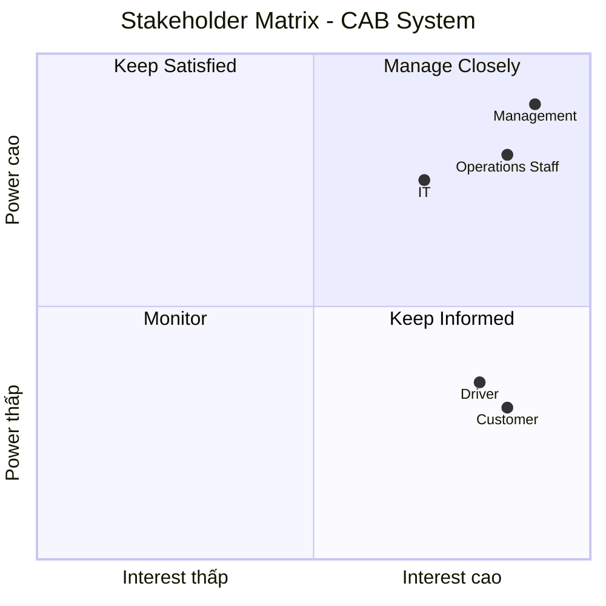
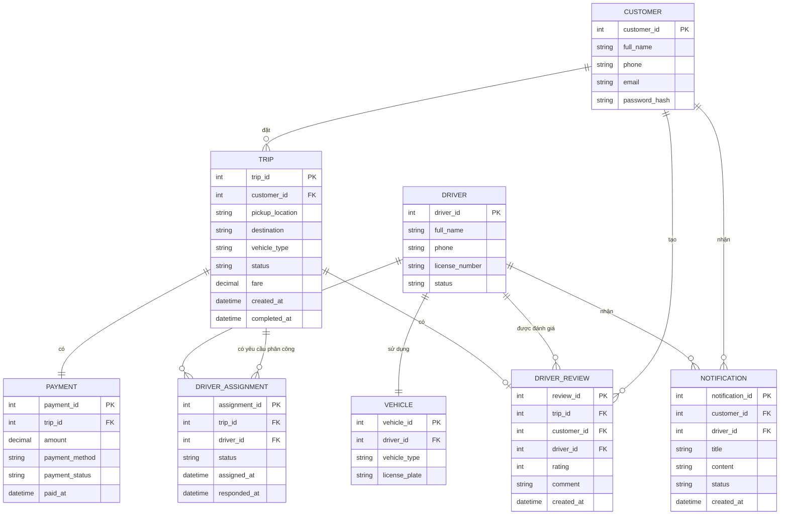
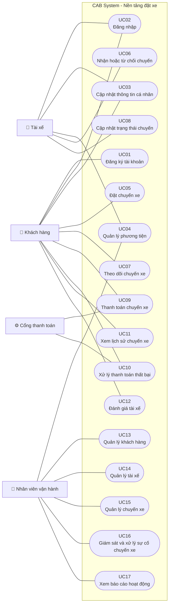

Bước 1: Đọc và phân tích yêu cầu của khách hàng ở giai đoạn sơ khởi - hiểu được business contact (ngữ cảnh của nghiệp vụ) và vấn đề của nghiệp vụ
# 1. Business Context – Ngữ cảnh nghiệp vụ

**CAB System** là nền tảng đặt xe trực tuyến của công ty **ABC**, kết nối **khách hàng – tài xế – nhân viên vận hành** trong toàn bộ quy trình đặt và thực hiện chuyến xe.

### Quy trình nghiệp vụ tổng quát

**Khách hàng tạo yêu cầu → Hệ thống tìm tài xế → Tài xế nhận chuyến → Thực hiện chuyến → Tính cước → Thanh toán → Đánh giá**

---

# 2. Business Problem – Vấn đề nghiệp vụ

Qua phân tích yêu cầu, có thể xác định các vấn đề nghiệp vụ hiện tại của công ty ABC như sau:

## Vấn đề 1: Phân công tài xế thủ công

Việc tìm kiếm và phân công tài xế hiện chủ yếu được thực hiện thủ công.

**Hậu quả:**

- Mất nhiều thời gian xử lý.
- Khó đáp ứng khi số lượng yêu cầu đặt xe tăng.
- Dễ xảy ra sai sót trong quá trình phân công.
- Khó tối ưu việc lựa chọn tài xế phù hợp.

## Vấn đề 2: Khách hàng khó theo dõi chuyến đi

Khách hàng chưa có khả năng theo dõi đầy đủ trạng thái của chuyến xe, bao gồm:

- Hệ thống đang tìm tài xế.
- Tài xế nào đã nhận chuyến.
- Tài xế đã đến điểm đón hay chưa.
- Chuyến xe đang ở trạng thái nào.
- Chuyến xe đã hoàn thành hay chưa.

**Hậu quả:**

- Khách hàng khó nắm bắt thông tin chuyến xe.
- Tăng số lượng yêu cầu hỗ trợ.
- Trải nghiệm khách hàng chưa tốt.

## Vấn đề 3: Thanh toán chưa được quản lý tập trung

Thông tin và trạng thái thanh toán chưa được quản lý thống nhất trên một hệ thống.

**Hậu quả:**

- Khó kiểm soát các giao dịch.
- Khó theo dõi doanh thu.
- Khó xử lý các giao dịch thanh toán thất bại.
- Khó tra cứu lịch sử thanh toán.

## Vấn đề 4: Khó mở rộng hệ thống

Hệ thống hiện tại khó đáp ứng khi số lượng khách hàng, tài xế và yêu cầu đặt xe tăng cao.

**Hậu quả:**

- Có nguy cơ giảm hiệu năng vào giờ cao điểm.
- Khó đáp ứng lượng truy cập lớn.
- Khó mở rộng tài nguyên khi nhu cầu tăng.

## Vấn đề 5: Khó quản lý vận hành

Nhân viên vận hành chưa có một hệ thống tập trung để quản lý và giám sát hoạt động của dịch vụ.

Hệ thống cần hỗ trợ:

- Theo dõi các chuyến xe đang diễn ra.
- Theo dõi trạng thái tài xế.
- Quản lý thông tin khách hàng.
- Quản lý thông tin tài xế.
- Xử lý các chuyến xe gặp lỗi.
- Tra cứu lịch sử chuyến xe.
- Tra cứu lịch sử giao dịch.

**Hậu quả:**

- Nhân viên vận hành mất nhiều thời gian xử lý.
- Khó giám sát toàn bộ hoạt động.
- Khó phát hiện và xử lý sự cố kịp thời.

## Vấn đề 6: Khả năng mở rộng chức năng còn hạn chế

Hệ thống hiện tại cần được thiết kế linh hoạt để đáp ứng các nhu cầu phát triển trong tương lai.

Doanh nghiệp có thể cần:

- Thêm các loại hình dịch vụ mới.
- Thêm các phương thức thanh toán mới.
- Thêm các nhà cung cấp dịch vụ thông báo.
- Thay đổi hoặc nâng cấp các thành phần kỹ thuật.
- Tích hợp thêm các dịch vụ bên ngoài.

**Hậu quả:**

- Việc thay đổi chức năng có thể mất nhiều thời gian.
- Chi phí bảo trì và phát triển hệ thống tăng.
- Khó tích hợp các dịch vụ mới trong tương lai.
## Tổng kết
Các vấn đề trên cho thấy công ty ABC cần xây dựng một **CAB System** có khả năng:
- Tự động hóa quá trình tìm kiếm và phân công tài xế.
- Cho phép khách hàng theo dõi trạng thái chuyến xe.
- Quản lý tập trung thông tin và giao dịch thanh toán.
- Hỗ trợ nhân viên vận hành giám sát toàn bộ hoạt động.
- Đảm bảo khả năng mở rộng khi số lượng người dùng tăng.
- Dễ dàng tích hợp thêm dịch vụ và công nghệ mới trong tương lai.

Bước 2: Xác định stakeholder lập bảng gồm 2 cột gồm tên và vai trò và vẽ ma trận stakeholder cho biêt tầm ảnh hưởng của stakeholder trên hệ thống (công cụ )
| Tên Stakeholder | Vai trò |
|---|---|
| Khách hàng | Đăng ký, đặt xe, theo dõi chuyến, thanh toán và đánh giá tài xế |
| Tài xế | Cập nhật hồ sơ, nhận/từ chối chuyến, thực hiện chuyến và cập nhật trạng thái |
| Nhân viên vận hành | Quản lý, giám sát và hỗ trợ xử lý khách hàng, tài xế, phương tiện và chuyến đi |
| Ban lãnh đạo / Management | Theo dõi doanh thu, số lượng chuyến, tỷ lệ hoàn thành, tỷ lệ hủy và hiệu quả hoạt động |
| Bộ phận kỹ thuật / IT | Quản lý, bảo trì, triển khai và đảm bảo hệ thống hoạt động ổn định |

Bước 3: Liệt kê các cái mục tiêu của nghiệp vụ (BG1 là gì BG2 là gì ) vd tự động tìm tài xế, hỗ trợ thanh toán mục đích cho phép thanh toán tiền mặt và thanh toán 
# 3. Business Goals – Mục tiêu nghiệp vụ

| Mã | Business Goal | Mục tiêu |
|---|---|---|
| BG01 | Tự động hóa tìm và phân công tài xế | Giảm sự phụ thuộc vào việc phân công tài xế thủ công và nâng cao hiệu quả xử lý yêu cầu đặt xe |
| BG02 | Cải thiện trải nghiệm khách hàng | Giúp khách hàng dễ dàng đặt xe, theo dõi trạng thái chuyến, thanh toán và đánh giá tài xế |
| BG03 | Quản lý thanh toán tập trung | Quản lý thông tin và trạng thái giao dịch một cách thống nhất, đồng thời hỗ trợ thanh toán điện tử |
| BG04 | Nâng cao hiệu quả vận hành | Hỗ trợ nhân viên vận hành quản lý, giám sát và xử lý các chuyến đi hiệu quả hơn |
| BG05 | Hỗ trợ quản lý phương tiện và tài xế | Cung cấp thông tin cần thiết để quản lý tài xế và phương tiện phục vụ hoạt động đặt xe |
| BG06 | Đảm bảo khả năng mở rộng hệ thống | Đảm bảo hệ thống có thể phục vụ số lượng lớn khách hàng và tài xế khi nhu cầu tăng |
| BG07 | Đảm bảo an toàn và bảo mật | Bảo vệ thông tin cá nhân, dữ liệu vị trí, dữ liệu giao dịch và kiểm soát quyền truy cập |
| BG08 | Hỗ trợ theo dõi và ra quyết định | Cung cấp dữ liệu và báo cáo về số lượng chuyến, doanh thu, tỷ lệ hoàn thành, tỷ lệ hủy và hiệu quả tài xế |
| BG09 | Tăng khả năng mở rộng dịch vụ | Cho phép doanh nghiệp bổ sung loại dịch vụ, phương thức thanh toán và kênh thông báo trong tương lai |
| BG10 | Tăng tính linh hoạt của hệ thống | Cho phép thay đổi hoặc mở rộng các thành phần kỹ thuật mà hạn chế ảnh hưởng đến các chức năng đang hoạt động |

Bước 4: Xác định phạm vi yêu cầu phải làm (score) VD: quản lí khách hàng, tài xế trong mbb phải biết làm cái gì, liệt kê ra các thứ mình phải làm và những thứ ngoài phạm vi không nên làm 
# 4. Scope – Phạm vi yêu cầu
## 4.1. Các yêu cầu phải làm (In Scope)

| STT | Phạm vi | Các nội dung cần thực hiện |
|---|---|---|
| 1 | Quản lý khách hàng | Đăng ký tài khoản, đăng nhập, cập nhật thông tin cá nhân, xem lịch sử chuyến đi |
| 2 | Quản lý tài xế | Quản lý hồ sơ tài xế, trạng thái hoạt động, nhận/từ chối chuyến, cập nhật trạng thái chuyến |
| 3 | Quản lý phương tiện | Quản lý thông tin phương tiện, loại xe, trạng thái phương tiện và liên kết phương tiện với tài xế |
| 4 | Đặt xe | Nhập điểm đón, điểm đến, chọn loại xe, gửi yêu cầu đặt xe |
| 5 | Tìm và phân công tài xế | Xác định tài xế phù hợp dựa trên vị trí, trạng thái sẵn sàng và tiêu chí vận hành; tiếp tục tìm tài xế khác khi tài xế từ chối hoặc không phản hồi |
| 6 | Theo dõi chuyến đi | Cho phép khách hàng theo dõi trạng thái yêu cầu và trạng thái chuyến đi |
| 7 | Thực hiện chuyến | Tài xế cập nhật các trạng thái như đến điểm đón, đón khách, đang di chuyển và hoàn thành chuyến |
| 8 | Tính cước | Xác định số tiền khách hàng phải trả dựa trên thông tin chuyến đi và loại dịch vụ |
| 9 | Thanh toán | Hỗ trợ thanh toán tiền mặt và thanh toán điện tử thông qua cổng thanh toán bên ngoài |
| 10 | Thông báo | Gửi thông báo về đặt xe, tài xế nhận chuyến, tài xế đến điểm đón, hoàn thành chuyến và kết quả thanh toán |
| 11 | Đánh giá tài xế | Cho phép khách hàng đánh giá tài xế sau khi hoàn thành chuyến |
| 12 | Quản lý vận hành | Nhân viên vận hành quản lý khách hàng, tài xế, phương tiện và chuyến đi; hỗ trợ xử lý các trường hợp chuyến bị lỗi |
| 13 | Báo cáo | Cung cấp báo cáo về số lượng chuyến, doanh thu, tỷ lệ hoàn thành, tỷ lệ hủy và hiệu quả hoạt động của tài xế |
| 14 | Phân quyền | Kiểm soát quyền truy cập đối với các chức năng quản trị và thao tác nhạy cảm |

## 4.2. Ngoài phạm vi (Out of Scope)

| STT | Nội dung ngoài phạm vi | Lý do |
|---|---|---|
| 1 | Xây dựng cổng thanh toán riêng | Doanh nghiệp yêu cầu tích hợp với nhà cung cấp thanh toán bên ngoài |
| 2 | Lưu thông tin nhạy cảm của thẻ hoặc tài khoản thanh toán | Doanh nghiệp không muốn dữ liệu nhạy cảm được lưu trực tiếp trong hệ thống CAB |
| 3 | Xây dựng các dịch vụ mới chưa được doanh nghiệp xác định | Chỉ yêu cầu hệ thống có khả năng mở rộng để bổ sung trong tương lai |
| 4 | Xây dựng nhà cung cấp thông báo riêng | Hệ thống chỉ cần có khả năng tích hợp với các nhà cung cấp thông báo |

Bước 5: Chuyển các yêu cầu thành bussiness requirment (mỗi bussiness requirment kí hiệu bằng BR01, BR01 là cái gì) vd br01 là đặt chuyến xe thì thiết kế bảng gồm mã, tên, diễn giải  
# Bước 5: Xác định Business Requirements

| Mã | Business Requirement | Mô tả |
|---|---|---|
| BR01 | Quản lý tài khoản khách hàng | Hệ thống phải cho phép khách hàng đăng ký, đăng nhập và cập nhật thông tin cá nhân |
| BR02 | Quản lý tài xế | Hệ thống phải cho phép doanh nghiệp quản lý thông tin và trạng thái hoạt động của tài xế |
| BR03 | Quản lý phương tiện | Hệ thống phải cho phép doanh nghiệp quản lý thông tin và trạng thái phương tiện phục vụ dịch vụ CAB |
| BR04 | Đặt xe | Hệ thống phải cho phép khách hàng tạo yêu cầu đặt xe với điểm đón, điểm đến và loại xe |
| BR05 | Tìm và phân công tài xế | Hệ thống phải hỗ trợ xác định và phân công tài xế phù hợp cho yêu cầu đặt xe |
| BR06 | Xử lý tài xế từ chối hoặc không phản hồi | Hệ thống phải tiếp tục tìm tài xế khác khi tài xế được đề xuất từ chối hoặc không phản hồi |
| BR07 | Theo dõi chuyến đi | Hệ thống phải cho phép khách hàng theo dõi trạng thái yêu cầu và chuyến đi |
| BR08 | Thực hiện chuyến xe | Hệ thống phải hỗ trợ tài xế cập nhật trạng thái trong quá trình thực hiện chuyến |
| BR09 | Lưu thông tin vị trí tài xế | Hệ thống phải lưu thông tin vị trí của tài xế để hỗ trợ tìm tài xế và dự kiến thời gian đến |
| BR10 | Tính cước | Hệ thống phải xác định số tiền khách hàng phải trả sau khi chuyến đi hoàn thành |
| BR11 | Thanh toán | Hệ thống phải hỗ trợ thanh toán tiền mặt và thanh toán điện tử thông qua nhà cung cấp bên ngoài |
| BR12 | Xử lý thanh toán thất bại | Hệ thống phải thông báo kết quả thanh toán và hỗ trợ xử lý lại giao dịch theo chính sách của doanh nghiệp |
| BR13 | Thông báo | Hệ thống phải gửi thông báo đến khách hàng và tài xế về các sự kiện liên quan đến chuyến đi và thanh toán |
| BR14 | Đánh giá tài xế | Hệ thống phải cho phép khách hàng đánh giá tài xế sau khi hoàn thành chuyến |
| BR15 | Quản lý và hỗ trợ vận hành | Hệ thống phải hỗ trợ nhân viên vận hành quản lý và giám sát khách hàng, tài xế, phương tiện và chuyến đi |
| BR16 | Phân quyền quản trị | Hệ thống phải kiểm soát quyền truy cập đối với các chức năng quản trị và thao tác nhạy cảm |
| BR17 | Báo cáo hoạt động | Hệ thống phải cung cấp báo cáo về số lượng chuyến, doanh thu, tỷ lệ hoàn thành, tỷ lệ hủy và hiệu quả hoạt động của tài xế |

Bước 6: Xây dựng các bussiness process 
# 6. Business Process – Quy trình nghiệp vụ

# Bước 6: Xác định Business Process

| Mã | Business Process | Các bước chính |
|---|---|---|
| BP01 | Quản lý tài khoản | Khách hàng/tài xế đăng ký → đăng nhập → cập nhật thông tin tài khoản |
| BP02 | Đặt xe | Khách hàng nhập điểm đón → nhập điểm đến → chọn loại xe → gửi yêu cầu đặt xe |
| BP03 | Tìm và phân công tài xế | Hệ thống tiếp nhận yêu cầu → xác định tài xế phù hợp → gửi yêu cầu → tài xế nhận hoặc từ chối → tiếp tục tìm tài xế khác nếu cần |
| BP04 | Theo dõi và thực hiện chuyến | Tài xế nhận chuyến → đến điểm đón → đón khách → thực hiện chuyến → hoàn thành chuyến |
| BP05 | Tính cước và thanh toán | Chuyến hoàn thành → xác định số tiền phải trả → khách hàng thanh toán tiền mặt hoặc điện tử → ghi nhận kết quả |
| BP06 | Thông báo | Hệ thống gửi thông báo khi đặt xe được tiếp nhận, tài xế nhận chuyến, tài xế đến điểm đón, chuyến hoàn thành và thanh toán có kết quả |
| BP07 | Đánh giá chuyến đi | Khách hàng xem thông tin chuyến → đánh giá tài xế sau khi chuyến hoàn thành |
| BP08 | Quản lý và giám sát vận hành | Nhân viên vận hành xem và quản lý khách hàng, tài xế, phương tiện, chuyến đi → hỗ trợ xử lý các trường hợp phát sinh |
| BP09 | Báo cáo hoạt động | Hệ thống tổng hợp dữ liệu → cung cấp số liệu về chuyến đi, doanh thu, tỷ lệ hoàn thành, tỷ lệ hủy và hiệu quả tài xế |

Bước 7: Thiết kế phân rả yêu cầu nghiệp vụ từ BR (mã viết tắt Funtional Requerement là FR). Ví dụ FR01: Tìm tài xế. FR02: Chọn những  tài xế online. FR03: chọn loại xe. FR04: Chọn tài xế có đánh giá cao. Lưu ý đọc vào yêu cầu có thì mới đưa vô các ví dụ chỉ là gợi ý chưa chắc có trong yêu cầu
# Bước 7: Phân rã yêu cầu nghiệp vụ thành Functional Requirements

| Mã BR | Business Requirement | Các Functional Requirements |
|---|---|---|
| BR01 | Quản lý tài khoản khách hàng | FR01: Đăng ký tài khoản FR02: Đăng nhập FR03: Cập nhật thông tin cá nhân |
| BR02 | Quản lý tài xế | FR04: Quản lý thông tin tài xế FR05: Cập nhật trạng thái hoạt động FR06: Nhận hoặc từ chối chuyến |
| BR03 | Quản lý phương tiện | FR07: Quản lý thông tin phương tiện |
| BR04 | Đặt xe | FR08: Nhập điểm đón FR09: Nhập điểm đến FR10: Chọn loại xe FR11: Gửi yêu cầu đặt xe |
| BR05 | Tìm và phân công tài xế | FR12: Tìm tài xế phù hợp FR13: Ưu tiên tài xế phù hợp và gần khách hàng |
| BR06 | Xử lý tài xế không nhận chuyến | FR14: Tiếp tục tìm tài xế khác khi tài xế từ chối hoặc không phản hồi FR15: Thông báo khi không tìm được tài xế |
| BR07 | Theo dõi chuyến đi | FR16: Theo dõi trạng thái chuyến FR17: Xem thông tin tài xế đã nhận chuyến FR18: Xem thời gian dự kiến tài xế đến |
| BR08 | Thực hiện chuyến | FR19: Cập nhật trạng thái đã đến điểm đón FR20: Cập nhật trạng thái đã đón khách FR21: Cập nhật trạng thái đang di chuyển FR22: Cập nhật trạng thái hoàn thành chuyến |
| BR09 | Quản lý vị trí tài xế | FR23: Lưu thông tin vị trí của tài xế |
| BR10 | Tính cước | FR24: Xác định số tiền khách hàng phải trả |
| BR11 | Thanh toán | FR25: Thanh toán bằng tiền mặt FR26: Thanh toán điện tử thông qua nhà cung cấp bên ngoài |
| BR12 | Xử lý thanh toán thất bại | FR27: Thông báo khi thanh toán điện tử thất bại FR28: Xử lý lại giao dịch theo chính sách của doanh nghiệp |
| BR13 | Thông báo | FR29: Thông báo khi yêu cầu đặt xe được tiếp nhận FR30: Thông báo khi tài xế nhận chuyến FR31: Thông báo khi tài xế đến điểm đón FR32: Thông báo khi chuyến hoàn thành FR33: Thông báo khi thanh toán có kết quả |
| BR14 | Lịch sử và đánh giá chuyến đi | FR34: Xem lịch sử chuyến đi FR35: Xem số tiền phải trả FR36: Đánh giá tài xế sau khi hoàn thành chuyến |
| BR15 | Quản lý và giám sát vận hành | FR37: Quản lý khách hàng FR38: Quản lý tài xế FR39: Quản lý phương tiện FR40: Quản lý chuyến đi FR41: Xem chuyến đang diễn ra FR42: Kiểm tra trạng thái tài xế FR43: Hỗ trợ xử lý chuyến bị lỗi |
| BR16 | Phân quyền và kiểm soát | FR44: Kiểm soát quyền truy cập chức năng quản trị FR45: Lưu vết các thao tác quan trọng |
| BR17 | Báo cáo hoạt động | FR46: Báo cáo số lượng chuyến FR47: Báo cáo doanh thu FR48: Báo cáo tỷ lệ chuyến hoàn thành FR49: Báo cáo tỷ lệ chuyến hủy FR50: Báo cáo hiệu quả hoạt động của tài xế |
# 8. Business Rules & Exceptions – Quy tắc và ngoại lệ nghiệp vụ

## 8.1. Business Rules – Quy tắc nghiệp vụ

| Mã | Business Rule | Diễn giải |
|---|---|---|
| **BRL01** | Chỉ tài xế Available mới được nhận chuyến | Tài xế phải ở trạng thái `Available` mới được hệ thống gửi yêu cầu và cho phép nhận chuyến. |
| **BRL02** | Một tài xế chỉ được nhận một chuyến tại một thời điểm | Tài xế đang thực hiện chuyến không được nhận thêm chuyến mới. |
| **BRL03** | Chuyến phải có tài xế mới được thực hiện | Hệ thống chỉ cho phép bắt đầu chuyến khi đã xác định tài xế. |
| **BRL04** | Chỉ chuyến đã hoàn thành mới được tính cước | Hệ thống thực hiện tính cước sau khi tài xế cập nhật chuyến hoàn thành. |
| **BRL05** | Chỉ chuyến hợp lệ mới được thanh toán | Hệ thống chỉ cho phép thanh toán đối với chuyến có cước phí hợp lệ. |
| **BRL06** | Chỉ được đánh giá sau khi chuyến hoàn thành | Khách hàng chỉ có thể đánh giá tài xế sau khi chuyến kết thúc. |
| **BRL07** | Tài xế từ chối chuyến sẽ không được phân công chuyến đó | Hệ thống chuyển sang tìm tài xế phù hợp khác. |
| **BRL08** | Mỗi chuyến chỉ được phân công một tài xế | Khi một tài xế đã nhận chuyến, hệ thống không tiếp tục phân công chuyến đó cho tài xế khác. |
| **BRL09** | Thanh toán điện tử phải được xác nhận từ cổng thanh toán | Hệ thống chỉ ghi nhận thanh toán thành công khi nhận được kết quả thành công từ cổng thanh toán. |
| **BRL10** | Tài xế phải cập nhật trạng thái theo quá trình thực hiện chuyến | Tài xế phải cập nhật các trạng thái như đã đến điểm đón, bắt đầu và hoàn thành chuyến. |

## 8.2. Exceptions – Ngoại lệ

| Mã | Exception | Cách xử lý |
|---|---|---|
| **EX01** | Không tìm được tài xế | Hệ thống tiếp tục tìm tài xế trong thời gian quy định; nếu vẫn không có thì thông báo cho khách hàng và cho phép hủy yêu cầu. |
| **EX02** | Khách hàng chờ quá lâu nhưng chưa có tài xế | Hệ thống gửi thông báo cho khách hàng về tình trạng tìm tài xế và cho phép khách hàng hủy yêu cầu. |
| **EX03** | Tài xế từ chối chuyến | Hệ thống ghi nhận từ chối và tìm tài xế phù hợp khác. |
| **EX04** | Tài xế không phản hồi | Sau thời gian chờ quy định, hệ thống chuyển yêu cầu cho tài xế khác. |
| **EX05** | Thanh toán điện tử thất bại | Hệ thống thông báo thanh toán thất bại và cho phép khách hàng thực hiện lại hoặc chọn phương thức khác. |
| **EX06** | Khách hàng hủy chuyến | Hệ thống kiểm tra trạng thái chuyến → hủy chuyến → cập nhật trạng thái và thông báo cho tài xế nếu đã được phân công. |
| **EX07** | Tài xế gặp sự cố trong chuyến | Tài xế báo sự cố → hệ thống thông báo cho nhân viên vận hành → nhân viên xử lý và cập nhật kết quả. |
| **EX08** | Hệ thống không gửi được thông báo | Hệ thống ghi nhận lỗi và thực hiện gửi lại theo cơ chế của hệ thống. |
| **EX09** | Cổng thanh toán không phản hồi | Hệ thống ghi nhận giao dịch đang chờ xử lý và không xác nhận thanh toán thành công khi chưa có kết quả. |
| **EX10** | Tài xế không thể tiếp tục chuyến | Nhân viên vận hành tiếp nhận sự cố và thực hiện phương án xử lý phù hợp. |
# 9. Data Modeling – Mô hình dữ liệu

## 9.1. Xác định thực thể

| STT | Tên thực thể | Mô tả |
|---|---|---|
| 1 | **Customer** | Lưu thông tin khách hàng sử dụng dịch vụ đặt xe. |
| 2 | **Driver** | Lưu thông tin tài xế. |
| 3 | **Vehicle** | Lưu thông tin phương tiện của tài xế. |
| 4 | **Trip** | Lưu thông tin chuyến xe do khách hàng tạo. |
| 5 | **DriverAssignment** | Lưu thông tin hệ thống đề xuất tài xế cho chuyến xe và kết quả phản hồi của tài xế. |
| 6 | **Payment** | Lưu thông tin thanh toán của chuyến xe. |
| 7 | **DriverReview** | Lưu đánh giá của khách hàng dành cho tài xế sau chuyến đi. |
| 8 | **Notification** | Lưu thông tin các thông báo được gửi đến khách hàng hoặc tài xế. |

## 9.2. Thuộc tính của các thực thể

| Thực thể | Thuộc tính |
|---|---|
| **Customer** | customer_id (PK), full_name, phone, email, password |
| **Driver** | driver_id (PK), full_name, phone, license_number, status |
| **Vehicle** | vehicle_id (PK), driver_id (FK), vehicle_type, license_plate |
| **Trip** | trip_id (PK), customer_id (FK), pickup_location, destination, vehicle_type, status, fare, created_at, completed_at |
| **DriverAssignment** | assignment_id (PK), trip_id (FK), driver_id (FK), status, assigned_at, responded_at |
| **Payment** | payment_id (PK), trip_id (FK), amount, payment_method, payment_status, paid_at |
| **DriverReview** | review_id (PK), trip_id (FK), customer_id (FK), driver_id (FK), rating, comment, created_at |
| **Notification** | notification_id (PK), customer_id (FK), driver_id (FK), title, content, status, created_at |

## 9.3. Quan hệ giữa các thực thể

| Quan hệ | Bội số |
|---|---|
| Customer – Trip | 1 : N |
| Driver – Vehicle | 1 : 1* |
| Trip – DriverAssignment | 1 : N |
| Driver – DriverAssignment | 1 : N |
| Trip – Payment | 1 : 1 |
| Customer – DriverReview | 1 : N |
| Driver – DriverReview | 1 : N |
| Trip – DriverReview | 1 : 0..1 |
| Customer – Notification | 1 : N |
| Driver – Notification | 1 : N |

Bước 10: Xác định các yêu cầu phi chức năng 
## Yêu cầu phi chức năng

| Mã | Nhóm | Yêu cầu phi chức năng |
|---|---|---|
| NFR-01 | Tính ổn định | Hệ thống phải hoạt động ổn định vào các thời điểm nhu cầu đặt xe tăng cao. |
| NFR-02 | Cô lập lỗi | Lỗi xảy ra ở chức năng thanh toán hoặc thông báo không được làm cho toàn bộ hệ thống đặt xe ngừng hoạt động. |
| NFR-03 | Khả năng mở rộng | Các thành phần của hệ thống phải có khả năng mở rộng độc lập khi tải tăng. |
| NFR-04 | Khả năng triển khai | Các chức năng mới có thể được triển khai từng phần và hạn chế ảnh hưởng đến các chức năng đang hoạt động. |
| NFR-05 | Xác thực | Khách hàng và tài xế phải được xác thực trước khi sử dụng các chức năng yêu cầu tài khoản. |
| NFR-06 | Phân quyền | Các thao tác quản trị phải được kiểm soát quyền truy cập theo vai trò người dùng. |
| NFR-07 | Bảo vệ dữ liệu | Thông tin cá nhân, thông tin phương tiện, dữ liệu vị trí và dữ liệu giao dịch phải được bảo vệ. |
| NFR-08 | Theo dõi và lưu vết | Hệ thống phải lưu vết các thao tác quan trọng để phục vụ kiểm tra và xử lý khi có sự cố. |
| NFR-09 | Khả năng mở rộng chức năng | Kiến trúc phải đủ linh hoạt để có thể bổ sung các loại dịch vụ mới trong tương lai. |
| NFR-10 | Mở rộng thanh toán | Có thể thêm các phương thức thanh toán mới mà không phải xây dựng lại toàn bộ hệ thống. |
| NFR-11 | Mở rộng thông báo | Có thể thêm nhà cung cấp dịch vụ thông báo mới mà không phải thay đổi toàn bộ hệ thống. |
| NFR-12 | Linh hoạt công nghệ | Có thể thay đổi một số thành phần kỹ thuật mà không phải xây dựng lại toàn bộ hệ thống. |

Bước 11: vẽ và xác định các usecase(vd UC01 tên là customer ) xác định xem có bao nhiêu usecase 

| Mã | Tên Use Case | Tác nhân chính |
|---|---|---|
| **UC01** | Đặt chuyến xe | Khách hàng |
| **UC02** | Theo dõi chuyến xe | Khách hàng |
| **UC03** | Hủy chuyến xe | Khách hàng |
| **UC04** | Đánh giá tài xế | Khách hàng |
| **UC05** | Nhận chuyến xe | Tài xế |
| **UC06** | Cập nhật trạng thái chuyến | Tài xế |
| **UC07** | Thực hiện chuyến xe | Tài xế |
| **UC08** | Thanh toán chuyến xe | Khách hàng |
| **UC09** | Tìm và phân công tài xế | Hệ thống |
| **UC10** | Tính cước chuyến xe | Hệ thống |
| **UC11** | Gửi thông báo | Hệ thống |
| **UC12** | Quản lý khách hàng | Nhân viên vận hành |
| **UC13** | Quản lý tài xế | Nhân viên vận hành |
| **UC14** | Quản lý vận hành | Nhân viên vận hành |
| **UC15** | Xử lý sự cố chuyến xe | Nhân viên vận hành |
| **UC16** | Tra cứu giao dịch | Nhân viên vận hành |
| **UC17** | Quản lý thanh toán | Nhân viên vận hành |
| **UC18** | Xử lý giao dịch thanh toán | Cổng thanh toán |
| **UC19** | Gửi thông báo bên ngoài | Dịch vụ thông báo |
| **UC20** | Quản lý tài khoản và phân quyền | Nhân viên vận hành |

## 11.1. Actors

| Mã | Actor | Vai trò |
|---|---|---|
| **A01** | Khách hàng | Đặt xe, theo dõi chuyến, thanh toán và đánh giá tài xế. |
| **A02** | Tài xế | Nhận chuyến, thực hiện chuyến và cập nhật trạng thái. |
| **A03** | Nhân viên vận hành | Quản lý và giám sát chuyến, khách hàng, tài xế và xử lý sự cố. |
| **A04** | Cổng thanh toán | Xử lý giao dịch thanh toán điện tử. |
| **A05** | Dịch vụ thông báo | Gửi thông báo đến khách hàng và tài xế. |

## 11. Use Case Diagram

Bước 12: Đặc tả usecase 
# 12. Đặc tả Use Case

## UC01 – Đặt chuyến xe

| Thành phần         | Nội dung                                                         |
| ------------------ | ---------------------------------------------------------------- |
| **Mã UC**          | UC01                                                             |
| **Tên**            | Đặt chuyến xe                                                    |
| **Actor chính**    | Khách hàng                                                       |
| **Mô tả**          | Cho phép khách hàng nhập thông tin và tạo yêu cầu đặt chuyến xe. |
| **Tiền điều kiện** | Khách hàng đã đăng nhập và hệ thống đang hoạt động.              |
| **Hậu điều kiện**  | Yêu cầu đặt xe được tạo và chuyển sang quá trình tìm tài xế.     |

### Luồng chính

| Bước | Actor                                                | Hệ thống                                                |
| ---- | ---------------------------------------------------- | ------------------------------------------------------- |
| 1    | Khách hàng nhập điểm đón, điểm đến và thời gian đón. |                                                         |
| 2    |                                                      | Kiểm tra tính đầy đủ và hợp lệ của thông tin chuyến xe. |
| 3    |                                                      | Hiển thị thông tin chuyến xe để khách hàng kiểm tra.    |
| 4    | Khách hàng xác nhận đặt xe.                          |                                                         |
| 5    |                                                      | Tạo yêu cầu đặt chuyến.                                 |
| 6    |                                                      | Chuyển yêu cầu sang UC09 – Tìm và phân công tài xế.     |

### Ngoại lệ

| Trường hợp                        | Xử lý                                                  |
| --------------------------------- | ------------------------------------------------------ |
| Thông tin thiếu hoặc không hợp lệ | Hệ thống thông báo lỗi và yêu cầu khách hàng nhập lại. |
| Hệ thống gặp lỗi                  | Hệ thống thông báo không thể tạo yêu cầu đặt chuyến.   |

---

## UC02 – Theo dõi chuyến xe

| Thành phần         | Nội dung                                                                      |
| ------------------ | ----------------------------------------------------------------------------- |
| **Mã UC**          | UC02                                                                          |
| **Tên**            | Theo dõi chuyến xe                                                            |
| **Actor chính**    | Khách hàng                                                                    |
| **Mô tả**          | Cho phép khách hàng theo dõi trạng thái chuyến xe và thông tin tài xế.        |
| **Tiền điều kiện** | Khách hàng có chuyến xe đang hoạt động.                                       |
| **Hậu điều kiện**  | Khách hàng xem được trạng thái hiện tại và thông tin liên quan đến chuyến xe. |

### Luồng chính

| Bước | Actor                                       | Hệ thống                                                |
| ---- | ------------------------------------------- | ------------------------------------------------------- |
| 1    | Khách hàng mở chức năng theo dõi chuyến xe. |                                                         |
| 2    |                                             | Lấy thông tin chuyến xe đang hoạt động của khách hàng.  |
| 3    |                                             | Hiển thị trạng thái hiện tại của chuyến xe.             |
| 4    |                                             | Hiển thị thông tin tài xế nếu chuyến đã được phân công. |
| 5    |                                             | Cập nhật trạng thái chuyến xe theo quá trình thực hiện. |
| 6    | Khách hàng theo dõi thông tin chuyến xe.    |                                                         |

### Ngoại lệ

| Trường hợp                        | Xử lý                                         |
| --------------------------------- | --------------------------------------------- |
| Không có chuyến xe đang hoạt động | Hệ thống thông báo không tìm thấy chuyến xe.  |
| Chưa có tài xế                    | Hệ thống hiển thị trạng thái đang tìm tài xế. |
| Không lấy được thông tin chuyến   | Hệ thống thông báo lỗi và ghi nhận log.       |

---

## UC03 – Hủy chuyến xe

| Thành phần         | Nội dung                                                                      |
| ------------------ | ----------------------------------------------------------------------------- |
| **Mã UC**          | UC03                                                                          |
| **Tên**            | Hủy chuyến xe                                                                 |
| **Actor chính**    | Khách hàng                                                                    |
| **Mô tả**          | Cho phép khách hàng hủy chuyến xe khi chuyến đang ở trạng thái được phép hủy. |
| **Tiền điều kiện** | Chuyến xe tồn tại và đang ở trạng thái có thể hủy.                            |
| **Hậu điều kiện**  | Chuyến xe chuyển sang trạng thái Đã hủy và các bên liên quan được thông báo.  |

### Luồng chính

| Bước | Actor                                 | Hệ thống                                                            |
| ---- | ------------------------------------- | ------------------------------------------------------------------- |
| 1    | Khách hàng chọn chuyến xe cần hủy.    |                                                                     |
| 2    | Khách hàng chọn chức năng Hủy chuyến. |                                                                     |
| 3    |                                       | Kiểm tra trạng thái hiện tại của chuyến xe.                         |
| 4    |                                       | Hiển thị thông tin xác nhận hủy chuyến.                             |
| 5    | Khách hàng xác nhận hủy chuyến.       |                                                                     |
| 6    |                                       | Cập nhật trạng thái chuyến xe thành Đã hủy.                         |
| 7    |                                       | Gửi thông báo cho các bên liên quan thông qua UC11 – Gửi thông báo. |

### Ngoại lệ

| Trường hợp                        | Xử lý                                             |
| --------------------------------- | ------------------------------------------------- |
| Chuyến xe không còn được phép hủy | Hệ thống thông báo và không thực hiện hủy chuyến. |
| Chuyến xe không tồn tại           | Hệ thống thông báo không tìm thấy chuyến xe.      |

---

## UC04 – Đánh giá tài xế

| Thành phần         | Nội dung                                                          |
| ------------------ | ----------------------------------------------------------------- |
| **Mã UC**          | UC04                                                              |
| **Tên**            | Đánh giá tài xế                                                   |
| **Actor chính**    | Khách hàng                                                        |
| **Mô tả**          | Cho phép khách hàng đánh giá tài xế sau khi chuyến xe hoàn thành. |
| **Tiền điều kiện** | Chuyến xe đã hoàn thành và khách hàng chưa đánh giá chuyến xe.    |
| **Hậu điều kiện**  | Đánh giá và nhận xét được lưu vào hệ thống.                       |

### Luồng chính

| Bước | Actor                                  | Hệ thống                                         |
| ---- | -------------------------------------- | ------------------------------------------------ |
| 1    | Khách hàng mở chuyến xe đã hoàn thành. |                                                  |
| 2    |                                        | Kiểm tra trạng thái chuyến xe và quyền đánh giá. |
| 3    | Khách hàng chọn chức năng Đánh giá.    |                                                  |
| 4    |                                        | Hiển thị biểu mẫu đánh giá.                      |
| 5    | Khách hàng nhập số sao và nhận xét.    |                                                  |
| 6    |                                        | Kiểm tra tính hợp lệ của dữ liệu đánh giá.       |
| 7    |                                        | Lưu đánh giá và nhận xét vào hệ thống.           |
| 8    |                                        | Thông báo đánh giá thành công.                   |

### Ngoại lệ

| Trường hợp                 | Xử lý                                       |
| -------------------------- | ------------------------------------------- |
| Chuyến xe chưa hoàn thành  | Hệ thống không cho phép đánh giá.           |
| Điểm đánh giá không hợp lệ | Hệ thống thông báo lỗi và yêu cầu nhập lại. |
| Khách hàng đã đánh giá     | Hệ thống không cho phép đánh giá lần nữa.   |

---

## UC05 – Nhận chuyến xe

| Thành phần         | Nội dung                                                         |
| ------------------ | ---------------------------------------------------------------- |
| **Mã UC**          | UC05                                                             |
| **Tên**            | Nhận chuyến xe                                                   |
| **Actor chính**    | Tài xế                                                           |
| **Mô tả**          | Cho phép tài xế xem và nhận yêu cầu chuyến xe phù hợp.           |
| **Tiền điều kiện** | Tài xế đang ở trạng thái Available và có yêu cầu chuyến phù hợp. |
| **Hậu điều kiện**  | Chuyến xe được xác nhận cho tài xế nhận.                         |

### Luồng chính

| Bước | Actor                           | Hệ thống                                                   |
| ---- | ------------------------------- | ---------------------------------------------------------- |
| 1    |                                 | Gửi yêu cầu chuyến xe đến tài xế phù hợp.                  |
| 2    | Tài xế xem thông tin chuyến xe. |                                                            |
| 3    | Tài xế chọn Nhận chuyến.        |                                                            |
| 4    |                                 | Kiểm tra chuyến xe còn khả dụng.                           |
| 5    |                                 | Xác nhận tài xế nhận chuyến và cập nhật trạng thái tài xế. |
| 6    |                                 | Gửi thông báo xác nhận cho khách hàng.                     |

### Ngoại lệ

| Trường hợp                          | Xử lý                                                      |
| ----------------------------------- | ---------------------------------------------------------- |
| Tài xế không ở trạng thái Available | Hệ thống không cho phép nhận chuyến.                       |
| Chuyến đã được tài xế khác nhận     | Hệ thống thông báo chuyến không còn khả dụng.              |
| Tài xế không phản hồi               | Hệ thống hết thời gian chờ và chuyển sang tìm tài xế khác. |

---

## UC06 – Cập nhật trạng thái chuyến

| Thành phần         | Nội dung                                                                  |
| ------------------ | ------------------------------------------------------------------------- |
| **Mã UC**          | UC06                                                                      |
| **Tên**            | Cập nhật trạng thái chuyến                                                |
| **Actor chính**    | Tài xế                                                                    |
| **Mô tả**          | Cho phép tài xế cập nhật trạng thái chuyến trong quá trình thực hiện.     |
| **Tiền điều kiện** | Tài xế đã được phân công cho chuyến xe.                                   |
| **Hậu điều kiện**  | Trạng thái chuyến xe được cập nhật và khách hàng nhận được thông tin mới. |

### Luồng chính

| Bước | Actor                                       | Hệ thống                                                     |
| ---- | ------------------------------------------- | ------------------------------------------------------------ |
| 1    | Tài xế chọn chuyến đang thực hiện.          |                                                              |
| 2    |                                             | Kiểm tra tài xế có được phân công cho chuyến hay không.      |
| 3    | Tài xế cập nhật trạng thái Đã đến điểm đón. |                                                              |
| 4    |                                             | Kiểm tra trạng thái có đúng trình tự và cập nhật trạng thái. |
| 5    | Tài xế cập nhật trạng thái Bắt đầu chuyến.  |                                                              |
| 6    |                                             | Kiểm tra và cập nhật trạng thái chuyến.                      |
| 7    | Tài xế cập nhật trạng thái Hoàn thành.      |                                                              |
| 8    |                                             | Kiểm tra và cập nhật trạng thái Hoàn thành.                  |
| 9    |                                             | Gửi thông báo trạng thái mới cho khách hàng.                 |

### Ngoại lệ

| Trường hợp                     | Xử lý                                              |
| ------------------------------ | -------------------------------------------------- |
| Tài xế không được phân công    | Hệ thống từ chối cập nhật.                         |
| Trạng thái không đúng trình tự | Hệ thống từ chối cập nhật và thông báo lỗi.        |
| Dữ liệu cập nhật không hợp lệ  | Hệ thống yêu cầu nhập hoặc thực hiện lại thao tác. |

---

## UC07 – Thực hiện chuyến xe

| Thành phần         | Nội dung                                                   |
| ------------------ | ---------------------------------------------------------- |
| **Mã UC**          | UC07                                                       |
| **Tên**            | Thực hiện chuyến xe                                        |
| **Actor chính**    | Tài xế                                                     |
| **Mô tả**          | Cho phép tài xế thực hiện chuyến từ điểm đón đến điểm đến. |
| **Tiền điều kiện** | Tài xế đã nhận và được phân công chuyến xe.                |
| **Hậu điều kiện**  | Chuyến xe hoàn thành hoặc được ghi nhận sự cố.             |

### Luồng chính

| Bước | Actor                                       | Hệ thống                                                                  |
| ---- | ------------------------------------------- | ------------------------------------------------------------------------- |
| 1    | Tài xế nhận chuyến xe.                      |                                                                           |
| 2    |                                             | Xác nhận tài xế được phân công và hiển thị thông tin chuyến.              |
| 3    | Tài xế di chuyển đến điểm đón.              |                                                                           |
| 4    | Tài xế cập nhật trạng thái Đã đến điểm đón. |                                                                           |
| 5    |                                             | Cập nhật trạng thái chuyến và thông báo cho khách hàng.                   |
| 6    | Tài xế đón khách và bắt đầu chuyến.         |                                                                           |
| 7    |                                             | Cập nhật trạng thái Bắt đầu chuyến.                                       |
| 8    | Tài xế di chuyển đến điểm đến.              |                                                                           |
| 9    | Tài xế kết thúc chuyến.                     |                                                                           |
| 10   |                                             | Cập nhật trạng thái Hoàn thành và chuyển sang UC10 – Tính cước chuyến xe. |

### Ngoại lệ

| Trường hợp                         | Xử lý                                     |
| ---------------------------------- | ----------------------------------------- |
| Có sự cố trong quá trình thực hiện | Chuyển sang UC15 – Xử lý sự cố chuyến xe. |
| Không thể cập nhật trạng thái      | Hệ thống thông báo lỗi và ghi nhận log.   |

---

## UC08 – Thanh toán chuyến xe

| Thành phần         | Nội dung                                                                           |
| ------------------ | ---------------------------------------------------------------------------------- |
| **Mã UC**          | UC08                                                                               |
| **Tên**            | Thanh toán chuyến xe                                                               |
| **Actor chính**    | Khách hàng                                                                         |
| **Mô tả**          | Cho phép khách hàng thanh toán cước chuyến bằng tiền mặt hoặc phương thức điện tử. |
| **Tiền điều kiện** | Chuyến xe đã hoàn thành và có số tiền cước cần thanh toán.                         |
| **Hậu điều kiện**  | Giao dịch thanh toán được ghi nhận với trạng thái tương ứng.                       |

### Luồng chính

| Bước | Actor                                                        | Hệ thống                                                  |
| ---- | ------------------------------------------------------------ | --------------------------------------------------------- |
| 1    |                                                              | Tính và hiển thị số tiền cần thanh toán.                  |
| 2    | Khách hàng chọn phương thức thanh toán.                      |                                                           |
| 3    | Nếu chọn tiền mặt, khách hàng thanh toán cho tài xế.         |                                                           |
| 4    | Tài xế xác nhận đã nhận tiền.                                |                                                           |
| 5    |                                                              | Ghi nhận thanh toán tiền mặt thành công.                  |
| 6    | Nếu chọn thanh toán điện tử, khách hàng xác nhận thanh toán. |                                                           |
| 7    |                                                              | Chuyển yêu cầu sang UC18 – Xử lý giao dịch thanh toán.    |
| 8    |                                                              | Nhận kết quả giao dịch và cập nhật trạng thái thanh toán. |

### Ngoại lệ

| Trường hợp                                | Xử lý                                                                                       |
| ----------------------------------------- | ------------------------------------------------------------------------------------------- |
| Thanh toán điện tử thất bại               | Hệ thống ghi nhận giao dịch thất bại và cho phép thanh toán lại hoặc chọn phương thức khác. |
| Không nhận được kết quả thanh toán        | Hệ thống chuyển giao dịch sang trạng thái Pending.                                          |
| Tài xế không xác nhận thanh toán tiền mặt | Hệ thống ghi nhận giao dịch chưa hoàn tất để xử lý.                                         |

---

## UC09 – Tìm và phân công tài xế

| Thành phần         | Nội dung                                                                    |
| ------------------ | --------------------------------------------------------------------------- |
| **Mã UC**          | UC09                                                                        |
| **Tên**            | Tìm và phân công tài xế                                                     |
| **Actor chính**    | Hệ thống                                                                    |
| **Mô tả**          | Tự động tìm tài xế phù hợp và phân công cho chuyến xe.                      |
| **Tiền điều kiện** | Có yêu cầu đặt xe chưa được phân công tài xế.                               |
| **Hậu điều kiện**  | Tài xế được phân công hoặc khách hàng được thông báo không tìm thấy tài xế. |

### Luồng chính

| Bước | Actor                    | Hệ thống                                              |
| ---- | ------------------------ | ----------------------------------------------------- |
| 1    |                          | Tiếp nhận yêu cầu đặt chuyến từ UC01.                 |
| 2    |                          | Tìm các tài xế đang ở trạng thái Available.           |
| 3    |                          | Lọc tài xế dựa trên các tiêu chí phù hợp.             |
| 4    |                          | Xác định tài xế phù hợp nhất.                         |
| 5    |                          | Gửi yêu cầu nhận chuyến cho tài xế.                   |
| 6    | Tài xế chấp nhận chuyến. |                                                       |
| 7    |                          | Kiểm tra và xác nhận tài xế nhận chuyến.              |
| 8    |                          | Cập nhật thông tin phân công chuyến xe.               |
| 9    |                          | Thông báo kết quả phân công cho khách hàng và tài xế. |

### Ngoại lệ

| Trường hợp                    | Xử lý                                                             |
| ----------------------------- | ----------------------------------------------------------------- |
| Tài xế từ chối                | Hệ thống tìm và gửi yêu cầu cho tài xế khác.                      |
| Tài xế không phản hồi         | Hệ thống hết thời gian chờ và tìm tài xế khác.                    |
| Không tìm thấy tài xế phù hợp | Hệ thống thông báo cho khách hàng và cập nhật trạng thái yêu cầu. |

---

## UC10 – Tính cước chuyến xe

| Thành phần         | Nội dung                                                         |
| ------------------ | ---------------------------------------------------------------- |
| **Mã UC**          | UC10                                                             |
| **Tên**            | Tính cước chuyến xe                                              |
| **Actor chính**    | Hệ thống                                                         |
| **Mô tả**          | Tự động tính tiền cước dựa trên thông tin chuyến và quy tắc giá. |
| **Tiền điều kiện** | Chuyến xe đã hoàn thành.                                         |
| **Hậu điều kiện**  | Tiền cước được tính và lưu vào thông tin chuyến xe.              |

### Luồng chính

| Bước | Actor | Hệ thống                                        |
| ---- | ----- | ----------------------------------------------- |
| 1    |       | Tiếp nhận thông tin chuyến xe đã hoàn thành.    |
| 2    |       | Lấy các thông tin cần thiết để tính cước.       |
| 3    |       | Xác định bảng giá và quy tắc tính cước áp dụng. |
| 4    |       | Tính tiền cước chuyến xe.                       |
| 5    |       | Lưu số tiền cước vào thông tin chuyến xe.       |
| 6    |       | Hiển thị số tiền cước cho khách hàng.           |
| 7    |       | Chuyển sang UC08 – Thanh toán chuyến xe.        |

### Ngoại lệ

| Trường hợp                   | Xử lý                                               |
| ---------------------------- | --------------------------------------------------- |
| Thiếu dữ liệu tính cước      | Hệ thống thông báo lỗi và ghi nhận để xử lý.        |
| Không xác định được bảng giá | Hệ thống không thực hiện tính cước và ghi nhận lỗi. |

---

## UC11 – Gửi thông báo

| Thành phần         | Nội dung                                                   |
| ------------------ | ---------------------------------------------------------- |
| **Mã UC**          | UC11                                                       |
| **Tên**            | Gửi thông báo                                              |
| **Actor chính**    | Hệ thống                                                   |
| **Mô tả**          | Tạo và gửi thông báo khi phát sinh các sự kiện quan trọng. |
| **Tiền điều kiện** | Có sự kiện cần thông báo và xác định được người nhận.      |
| **Hậu điều kiện**  | Thông báo được gửi hoặc ghi nhận trạng thái gửi thất bại.  |

### Luồng chính

| Bước | Actor | Hệ thống                                         |
| ---- | ----- | ------------------------------------------------ |
| 1    |       | Phát hiện sự kiện cần gửi thông báo.             |
| 2    |       | Xác định người nhận và loại thông báo.           |
| 3    |       | Tạo nội dung thông báo.                          |
| 4    |       | Gửi yêu cầu sang UC19 – Gửi thông báo bên ngoài. |
| 5    |       | Nhận kết quả gửi thông báo.                      |
| 6    |       | Ghi nhận trạng thái gửi thông báo.               |

### Ngoại lệ

| Trường hợp                     | Xử lý                                                |
| ------------------------------ | ---------------------------------------------------- |
| Không xác định được người nhận | Hệ thống ghi nhận lỗi và không gửi thông báo.        |
| Gửi thông báo thất bại         | Hệ thống ghi log và thực hiện retry theo chính sách. |

---

## UC12 – Quản lý khách hàng

| Thành phần         | Nội dung                                                                |
| ------------------ | ----------------------------------------------------------------------- |
| **Mã UC**          | UC12                                                                    |
| **Tên**            | Quản lý khách hàng                                                      |
| **Actor chính**    | Nhân viên vận hành                                                      |
| **Mô tả**          | Cho phép nhân viên vận hành quản lý thông tin và trạng thái khách hàng. |
| **Tiền điều kiện** | Nhân viên đã đăng nhập và có quyền quản lý khách hàng.                  |
| **Hậu điều kiện**  | Thông tin khách hàng được thêm, cập nhật hoặc tra cứu thành công.       |

### Luồng chính

| Bước | Actor                                                   | Hệ thống                                            |
| ---- | ------------------------------------------------------- | --------------------------------------------------- |
| 1    | Nhân viên chọn chức năng Quản lý khách hàng.            |                                                     |
| 2    |                                                         | Hiển thị danh sách và chức năng quản lý khách hàng. |
| 3    | Nhân viên tìm kiếm hoặc chọn khách hàng.                |                                                     |
| 4    |                                                         | Tìm kiếm và hiển thị thông tin khách hàng.          |
| 5    | Nhân viên xem, thêm hoặc cập nhật thông tin khách hàng. |                                                     |
| 6    |                                                         | Kiểm tra tính hợp lệ của dữ liệu.                   |
| 7    |                                                         | Lưu thông tin thay đổi.                             |
| 8    |                                                         | Thông báo kết quả thao tác.                         |

### Ngoại lệ

| Trường hợp                | Xử lý                                       |
| ------------------------- | ------------------------------------------- |
| Không tìm thấy khách hàng | Hệ thống thông báo không tìm thấy dữ liệu.  |
| Dữ liệu không hợp lệ      | Hệ thống thông báo lỗi và yêu cầu nhập lại. |
| Nhân viên không có quyền  | Hệ thống từ chối thao tác.                  |

---

## UC13 – Quản lý tài xế

| Thành phần         | Nội dung                                                                          |
| ------------------ | --------------------------------------------------------------------------------- |
| **Mã UC**          | UC13                                                                              |
| **Tên**            | Quản lý tài xế                                                                    |
| **Actor chính**    | Nhân viên vận hành                                                                |
| **Mô tả**          | Cho phép nhân viên quản lý thông tin, trạng thái và lịch sử hoạt động của tài xế. |
| **Tiền điều kiện** | Nhân viên đã đăng nhập và có quyền quản lý tài xế.                                |
| **Hậu điều kiện**  | Thông tin tài xế được thêm, cập nhật hoặc tra cứu thành công.                     |

### Luồng chính

| Bước | Actor                                          | Hệ thống                                             |
| ---- | ---------------------------------------------- | ---------------------------------------------------- |
| 1    | Nhân viên chọn chức năng Quản lý tài xế.       |                                                      |
| 2    |                                                | Hiển thị danh sách tài xế và các chức năng quản lý.  |
| 3    | Nhân viên tìm kiếm hoặc chọn tài xế.           |                                                      |
| 4    |                                                | Hiển thị thông tin tài xế.                           |
| 5    | Nhân viên thêm hoặc cập nhật thông tin tài xế. |                                                      |
| 6    |                                                | Kiểm tra tính hợp lệ của dữ liệu.                    |
| 7    |                                                | Lưu thông tin tài xế.                                |
| 8    |                                                | Hiển thị trạng thái và lịch sử hoạt động của tài xế. |

### Ngoại lệ

| Trường hợp               | Xử lý                                      |
| ------------------------ | ------------------------------------------ |
| Không tìm thấy tài xế    | Hệ thống thông báo không tìm thấy dữ liệu. |
| Thông tin không hợp lệ   | Hệ thống không lưu và yêu cầu chỉnh sửa.   |
| Nhân viên không có quyền | Hệ thống từ chối thao tác.                 |

---

## UC14 – Quản lý vận hành

| Thành phần         | Nội dung                                                                     |
| ------------------ | ---------------------------------------------------------------------------- |
| **Mã UC**          | UC14                                                                         |
| **Tên**            | Quản lý vận hành                                                             |
| **Actor chính**    | Nhân viên vận hành                                                           |
| **Mô tả**          | Cho phép nhân viên giám sát các chuyến xe và hoạt động của tài xế.           |
| **Tiền điều kiện** | Nhân viên đã đăng nhập và có quyền vận hành.                                 |
| **Hậu điều kiện**  | Tình trạng vận hành được theo dõi và các vấn đề được xử lý hoặc chuyển tiếp. |

### Luồng chính

| Bước | Actor                                               | Hệ thống                                                       |
| ---- | --------------------------------------------------- | -------------------------------------------------------------- |
| 1    | Nhân viên mở màn hình quản lý vận hành.             |                                                                |
| 2    |                                                     | Hiển thị danh sách các chuyến xe đang hoạt động.               |
| 3    |                                                     | Hiển thị trạng thái và thông tin tài xế.                       |
| 4    | Nhân viên theo dõi tình trạng vận hành.             |                                                                |
| 5    | Nhân viên phát hiện vấn đề và chọn phương án xử lý. |                                                                |
| 6    |                                                     | Thực hiện xử lý hoặc chuyển sang UC15 – Xử lý sự cố chuyến xe. |
| 7    |                                                     | Ghi nhận kết quả xử lý.                                        |

### Ngoại lệ

| Trường hợp                   | Xử lý                                         |
| ---------------------------- | --------------------------------------------- |
| Không lấy được dữ liệu       | Hệ thống thông báo lỗi và ghi log.            |
| Phát hiện sự cố nghiêm trọng | Hệ thống chuyển thông tin sang UC15 để xử lý. |

---

## UC15 – Xử lý sự cố chuyến xe

| Thành phần         | Nội dung                                                               |
| ------------------ | ---------------------------------------------------------------------- |
| **Mã UC**          | UC15                                                                   |
| **Tên**            | Xử lý sự cố chuyến xe                                                  |
| **Actor chính**    | Nhân viên vận hành                                                     |
| **Mô tả**          | Cho phép nhân viên tiếp nhận và xử lý sự cố phát sinh trong chuyến xe. |
| **Tiền điều kiện** | Có sự cố được ghi nhận.                                                |
| **Hậu điều kiện**  | Sự cố được xử lý và kết quả được lưu vào hệ thống.                     |

### Luồng chính

| Bước | Actor                                                       | Hệ thống                                                        |
| ---- | ----------------------------------------------------------- | --------------------------------------------------------------- |
| 1    | Nhân viên tiếp nhận thông tin sự cố.                        |                                                                 |
| 2    |                                                             | Hiển thị thông tin sự cố và chuyến xe liên quan.                |
| 3    | Nhân viên kiểm tra thông tin chuyến xe và tình trạng sự cố. |                                                                 |
| 4    |                                                             | Cung cấp thông tin cần thiết để nhân viên xác định nguyên nhân. |
| 5    | Nhân viên liên hệ các bên liên quan nếu cần.                |                                                                 |
| 6    | Nhân viên thực hiện phương án xử lý.                        |                                                                 |
| 7    |                                                             | Cập nhật trạng thái chuyến xe và thông tin sự cố.               |
| 8    |                                                             | Lưu kết quả xử lý và thông báo cho các bên liên quan nếu cần.   |

### Ngoại lệ

| Trường hợp                 | Xử lý                                                               |
| -------------------------- | ------------------------------------------------------------------- |
| Không đủ thông tin         | Hệ thống yêu cầu bổ sung thông tin.                                 |
| Sự cố nghiêm trọng         | Nhân viên chuyển cấp xử lý phù hợp và hệ thống ghi nhận trạng thái. |
| Không thể cập nhật kết quả | Hệ thống thông báo lỗi và ghi log.                                  |

---

## UC16 – Tra cứu giao dịch

| Thành phần         | Nội dung                                                         |
| ------------------ | ---------------------------------------------------------------- |
| **Mã UC**          | UC16                                                             |
| **Tên**            | Tra cứu giao dịch                                                |
| **Actor chính**    | Nhân viên vận hành                                               |
| **Mô tả**          | Cho phép nhân viên tìm kiếm và xem lịch sử giao dịch thanh toán. |
| **Tiền điều kiện** | Nhân viên đã đăng nhập và có quyền tra cứu giao dịch.            |
| **Hậu điều kiện**  | Kết quả giao dịch phù hợp được hiển thị.                         |

### Luồng chính

| Bước | Actor                                     | Hệ thống                                    |
| ---- | ----------------------------------------- | ------------------------------------------- |
| 1    | Nhân viên mở chức năng Tra cứu giao dịch. |                                             |
| 2    |                                           | Hiển thị biểu mẫu tìm kiếm.                 |
| 3    | Nhân viên nhập điều kiện tìm kiếm.        |                                             |
| 4    |                                           | Kiểm tra điều kiện tìm kiếm.                |
| 5    |                                           | Tìm các giao dịch phù hợp.                  |
| 6    |                                           | Hiển thị thông tin và trạng thái giao dịch. |
| 7    | Nhân viên xem thông tin giao dịch.        |                                             |

### Ngoại lệ

| Trường hợp                      | Xử lý                                         |
| ------------------------------- | --------------------------------------------- |
| Không có giao dịch phù hợp      | Hệ thống thông báo không tìm thấy dữ liệu.    |
| Điều kiện tìm kiếm không hợp lệ | Hệ thống yêu cầu nhập lại điều kiện tìm kiếm. |

---

## UC17 – Quản lý thanh toán

| Thành phần         | Nội dung                                                                   |
| ------------------ | -------------------------------------------------------------------------- |
| **Mã UC**          | UC17                                                                       |
| **Tên**            | Quản lý thanh toán                                                         |
| **Actor chính**    | Nhân viên vận hành                                                         |
| **Mô tả**          | Cho phép nhân viên theo dõi và quản lý trạng thái các khoản thanh toán.    |
| **Tiền điều kiện** | Nhân viên đã đăng nhập và có quyền quản lý thanh toán.                     |
| **Hậu điều kiện**  | Thông tin và trạng thái thanh toán được kiểm tra, đối chiếu hoặc cập nhật. |

### Luồng chính

| Bước | Actor                                              | Hệ thống                                             |
| ---- | -------------------------------------------------- | ---------------------------------------------------- |
| 1    | Nhân viên mở chức năng Quản lý thanh toán.         |                                                      |
| 2    |                                                    | Hiển thị danh sách các khoản thanh toán.             |
| 3    | Nhân viên tìm kiếm và chọn giao dịch cần kiểm tra. |                                                      |
| 4    |                                                    | Hiển thị thông tin và trạng thái giao dịch.          |
| 5    | Nhân viên đối chiếu kết quả thanh toán.            |                                                      |
| 6    |                                                    | Kiểm tra thông tin và xác định trạng thái giao dịch. |
| 7    | Nhân viên cập nhật thông tin nếu được phép.        |                                                      |
| 8    |                                                    | Kiểm tra và lưu thay đổi.                            |

### Ngoại lệ

| Trường hợp                                 | Xử lý                                      |
| ------------------------------------------ | ------------------------------------------ |
| Không tìm thấy giao dịch                   | Hệ thống thông báo không tìm thấy dữ liệu. |
| Giao dịch không hợp lệ hoặc không xác định | Hệ thống ghi nhận giao dịch để xử lý.      |
| Nhân viên không có quyền cập nhật          | Hệ thống từ chối thao tác.                 |

---

## UC18 – Xử lý giao dịch thanh toán

| Thành phần         | Nội dung                                                   |
| ------------------ | ---------------------------------------------------------- |
| **Mã UC**          | UC18                                                       |
| **Tên**            | Xử lý giao dịch thanh toán                                 |
| **Actor chính**    | Cổng thanh toán                                            |
| **Mô tả**          | Tiếp nhận và xử lý yêu cầu thanh toán điện tử từ hệ thống. |
| **Tiền điều kiện** | Có yêu cầu thanh toán điện tử hợp lệ từ hệ thống.          |
| **Hậu điều kiện**  | Kết quả giao dịch được trả về hệ thống.                    |

### Luồng chính

| Bước | Actor                                                 | Hệ thống                                            |
| ---- | ----------------------------------------------------- | --------------------------------------------------- |
| 1    |                                                       | Gửi yêu cầu thanh toán điện tử đến cổng thanh toán. |
| 2    | Cổng thanh toán tiếp nhận yêu cầu.                    |                                                     |
| 3    |                                                       | Cổng thanh toán kiểm tra thông tin giao dịch.       |
| 4    | Cổng thanh toán thực hiện xử lý thanh toán.           |                                                     |
| 5    |                                                       | Cổng thanh toán xác định kết quả giao dịch.         |
| 6    | Cổng thanh toán trả kết quả thành công hoặc thất bại. |                                                     |
| 7    |                                                       | Tiếp nhận kết quả và cập nhật trạng thái giao dịch. |

### Ngoại lệ

| Trường hợp                       | Xử lý                                                      |
| -------------------------------- | ---------------------------------------------------------- |
| Thông tin giao dịch không hợp lệ | Cổng thanh toán từ chối giao dịch và trả kết quả thất bại. |
| Giao dịch thất bại               | Hệ thống ghi nhận trạng thái thất bại.                     |
| Không nhận được phản hồi         | Hệ thống chuyển giao dịch sang trạng thái Pending.         |

---

## UC19 – Gửi thông báo bên ngoài

| Thành phần         | Nội dung                                                                   |
| ------------------ | -------------------------------------------------------------------------- |
| **Mã UC**          | UC19                                                                       |
| **Tên**            | Gửi thông báo bên ngoài                                                    |
| **Actor chính**    | Dịch vụ thông báo                                                          |
| **Mô tả**          | Tiếp nhận yêu cầu từ hệ thống và gửi thông báo đến khách hàng hoặc tài xế. |
| **Tiền điều kiện** | Có yêu cầu gửi thông báo hợp lệ.                                           |
| **Hậu điều kiện**  | Thông báo được gửi hoặc trả về trạng thái thất bại.                        |

### Luồng chính

| Bước | Actor                                      | Hệ thống                                                    |
| ---- | ------------------------------------------ | ----------------------------------------------------------- |
| 1    |                                            | Gửi nội dung và thông tin người nhận đến dịch vụ thông báo. |
| 2    | Dịch vụ thông báo tiếp nhận yêu cầu.       |                                                             |
| 3    |                                            | Kiểm tra thông tin người nhận và nội dung thông báo.        |
| 4    | Dịch vụ thông báo thực hiện gửi thông báo. |                                                             |
| 5    |                                            | Tiếp nhận kết quả gửi thông báo.                            |
| 6    |                                            | Lưu trạng thái gửi thông báo.                               |

### Ngoại lệ

| Trường hợp                        | Xử lý                                                                  |
| --------------------------------- | ---------------------------------------------------------------------- |
| Thông tin người nhận không hợp lệ | Dịch vụ thông báo trả kết quả thất bại.                                |
| Dịch vụ gửi thông báo thất bại    | Trả trạng thái thất bại để hệ thống thực hiện retry.                   |
| Dịch vụ thông báo không phản hồi  | Hệ thống ghi nhận trạng thái chưa xác định và xử lý theo cơ chế retry. |

---

## UC20 – Quản lý tài khoản và phân quyền

| Thành phần         | Nội dung                                                                            |
| ------------------ | ----------------------------------------------------------------------------------- |
| **Mã UC**          | UC20                                                                                |
| **Tên**            | Quản lý tài khoản và phân quyền                                                     |
| **Actor chính**    | Nhân viên vận hành                                                                  |
| **Mô tả**          | Cho phép quản lý tài khoản người dùng và quyền truy cập các chức năng của hệ thống. |
| **Tiền điều kiện** | Nhân viên đã đăng nhập và có quyền quản trị tài khoản.                              |
| **Hậu điều kiện**  | Tài khoản hoặc quyền truy cập được tạo, cập nhật hoặc thay đổi thành công.          |

### Luồng chính

| Bước | Actor                                                   | Hệ thống                                              |
| ---- | ------------------------------------------------------- | ----------------------------------------------------- |
| 1    | Nhân viên mở chức năng Quản lý tài khoản và phân quyền. |                                                       |
| 2    |                                                         | Kiểm tra quyền quản trị của nhân viên.                |
| 3    |                                                         | Hiển thị danh sách tài khoản và chức năng quản lý.    |
| 4    | Nhân viên tìm kiếm hoặc chọn tài khoản.                 |                                                       |
| 5    |                                                         | Hiển thị thông tin tài khoản và quyền hiện tại.       |
| 6    | Nhân viên thêm hoặc cập nhật thông tin tài khoản.       |                                                       |
| 7    | Nhân viên gán hoặc thay đổi vai trò/quyền truy cập.     |                                                       |
| 8    |                                                         | Kiểm tra tính hợp lệ của thông tin và quyền được gán. |
| 9    |                                                         | Lưu thông tin tài khoản và quyền truy cập.            |
| 10   |                                                         | Thông báo kết quả thao tác.                           |

### Ngoại lệ

| Trường hợp                        | Xử lý                                                  |
| --------------------------------- | ------------------------------------------------------ |
| Tài khoản không hợp lệ            | Hệ thống thông báo lỗi và yêu cầu chỉnh sửa.           |
| Nhân viên không có quyền quản trị | Hệ thống từ chối thao tác.                             |
| Quyền được gán không hợp lệ       | Hệ thống không lưu thay đổi và yêu cầu chọn lại quyền. |
| Tài khoản đã tồn tại              | Hệ thống thông báo và yêu cầu kiểm tra lại thông tin.  |

Bước 13: Những tiêu chí chấp nhận (AC) là tập hợp các điều kiện tính năng phải đáp ứng để giúp ng làm phần mềm xác định khi nào yêu cầu kết thúc và nghệm thu> Hãy thiết kế ra các AC
## 13. Acceptance Criteria – Tiêu chí chấp nhận

| Mã AC | Tính năng | Tiêu chí chấp nhận |
|---|---|---|
| **AC01** | Đặt chuyến xe | Khi khách hàng nhập đầy đủ điểm đón, điểm đến và thời gian đón hợp lệ, hệ thống phải cho phép xác nhận và tạo chuyến xe thành công. |
| **AC02** | Kiểm tra thông tin | Khi khách hàng nhập thiếu hoặc sai thông tin đặt chuyến, hệ thống phải hiển thị thông báo lỗi và không tạo chuyến. |
| **AC03** | Hủy chuyến | Khi chuyến đang ở trạng thái cho phép hủy, khách hàng xác nhận hủy thì hệ thống phải cập nhật chuyến thành trạng thái đã hủy. |
| **AC04** | Tìm tài xế | Khi có yêu cầu đặt xe, hệ thống phải tự động tìm các tài xế đang Available và phù hợp với yêu cầu chuyến xe. |
| **AC05** | Nhận chuyến | Khi tài xế đang Available và nhận yêu cầu trong thời gian quy định, hệ thống phải xác nhận tài xế nhận chuyến thành công. |
| **AC06** | Phân công tài xế | Khi tài xế nhận chuyến, hệ thống phải ghi nhận tài xế được phân công và thông báo thông tin tài xế cho khách hàng. |
| **AC07** | Không tìm được tài xế | Khi hệ thống không tìm được tài xế phù hợp sau thời gian quy định, hệ thống phải thông báo cho khách hàng và cập nhật trạng thái yêu cầu. |
| **AC08** | Theo dõi chuyến | Khi chuyến đang hoạt động, khách hàng phải xem được trạng thái hiện tại và thông tin tài xế được phân công. |
| **AC09** | Thực hiện chuyến | Tài xế phải có thể cập nhật lần lượt các trạng thái nhận chuyến, đã đến điểm đón, bắt đầu chuyến và hoàn thành chuyến. |
| **AC10** | Tính cước | Khi chuyến được cập nhật hoàn thành, hệ thống phải tự động tính cước theo thông tin chuyến và quy định giá hiện hành. |
| **AC11** | Thanh toán | Sau khi có cước phí, khách hàng phải có thể lựa chọn thanh toán bằng tiền mặt hoặc phương thức thanh toán điện tử. |
| **AC12** | Thanh toán thất bại | Khi giao dịch điện tử thất bại, hệ thống phải ghi nhận trạng thái thất bại, thông báo cho khách hàng và cho phép thực hiện thanh toán lại. |
| **AC13** | Quản lý khách hàng | Nhân viên vận hành phải có thể thêm, xem, cập nhật và tìm kiếm thông tin khách hàng trong hệ thống. |
| **AC14** | Quản lý tài xế | Nhân viên vận hành phải có thể thêm, xem, cập nhật thông tin và theo dõi trạng thái hoạt động của tài xế. |
| **AC15** | Quản lý vận hành | Nhân viên vận hành phải có thể theo dõi các chuyến xe đang diễn ra, phát hiện và ghi nhận kết quả xử lý sự cố. |
| **AC16** | Thông báo | Khi phát sinh các sự kiện như đặt xe, nhận chuyến, thay đổi trạng thái hoặc thanh toán, hệ thống phải gửi thông báo đến đúng đối tượng. |
| **AC17** | Đánh giá tài xế | Sau khi chuyến hoàn thành, khách hàng phải có thể đánh giá tài xế bằng điểm đánh giá và nhận xét. |
| **AC18** | Tra cứu lịch sử | Nhân viên vận hành phải có thể tra cứu lịch sử chuyến xe và các giao dịch thanh toán đã phát sinh. |
| **AC19** | Phân quyền | Người dùng chỉ được truy cập và thực hiện các chức năng phù hợp với vai trò và quyền hạn được cấp. |
| **AC20** | Khả năng mở rộng | Hệ thống phải cho phép tích hợp thêm phương thức thanh toán, dịch vụ thông báo hoặc loại dịch vụ mới mà không phải thay đổi toàn bộ hệ thống. |

Bước 14: Truy xuất nguồn gốc yêu cầu - quá trình theo dõi yêu cầu bắt dâu khi nào thiết kế thế nào cho tới biết kiểm thử. Bảng RTM (Ma trận truy xuất yêu cầu trong bảng sẽ có các cột: MÃ business goal, mã BR, mã FR, UC, AC, TC-testcase)
# 14. Requirements Traceability Matrix – RTM

| BC | BR | FR | UC | AC |
|---|---|---|---|---|
| Phân công tài xế thủ công | **BR01** – Đặt chuyến xe | FR01–FR05 – Nhập thông tin và tạo chuyến | **UC01** – Đặt chuyến xe | **AC01, AC02** |
| Phân công tài xế thủ công | **BR03** – Tự động tìm tài xế | FR09–FR16 – Tìm và gửi yêu cầu nhận chuyến | **UC09** – Tìm và phân công tài xế | **AC04, AC05, AC07** |
| Khó theo dõi chuyến đi | **BR07** – Theo dõi trạng thái chuyến | FR29–FR31 – Xem và cập nhật trạng thái | **UC02** – Theo dõi chuyến xe | **AC08** |
| Khó theo dõi chuyến đi | **BR08** – Thực hiện chuyến xe | FR32–FR34 – Cập nhật trạng thái chuyến | **UC07** – Thực hiện chuyến xe | **AC09** |
| Thanh toán chưa tập trung | **BR09** – Tính cước chuyến xe | FR35–FR36 – Tính và hiển thị cước | **UC10** – Tính cước chuyến xe | **AC10** |
| Thanh toán chưa tập trung | **BR10** – Thanh toán chuyến xe | FR37–FR40 – Chọn và xử lý thanh toán | **UC08** – Thanh toán chuyến xe | **AC11, AC12** |
| Khó quản lý vận hành | **BR05** – Quản lý tài xế | FR19–FR23 – Quản lý thông tin và trạng thái tài xế | **UC13** – Quản lý tài xế | **AC14** |
| Khó quản lý vận hành | **BR06** – Quản lý khách hàng | FR24–FR28 – Quản lý thông tin khách hàng | **UC12** – Quản lý khách hàng | **AC13** |
| Khó quản lý vận hành | **BR13** – Quản lý và giám sát vận hành | FR41–FR43 – Theo dõi và xử lý sự cố | **UC14** – Quản lý vận hành | **AC15** |
| Khó theo dõi thông tin | **BR12** – Gửi thông báo | FR44–FR47 – Gửi thông báo | **UC11** – Gửi thông báo | **AC16** |
| Cải thiện trải nghiệm khách hàng | **BR15** – Đánh giá tài xế | FR48–FR50 – Đánh giá và nhận xét | **UC04** – Đánh giá tài xế | **AC17** |
| Khó quản lý vận hành | **BR14** – Quản lý lịch sử | FR51–FR52 – Tra cứu lịch sử | **UC16** – Tra cứu giao dịch | **AC18** |
| Khó quản lý vận hành | **BR16** – Quản lý tài khoản và phân quyền | FR53–FR54 – Quản lý quyền truy cập | **UC20** – Quản lý tài khoản và phân quyền | **AC19** |
| Khó mở rộng hệ thống | **BR17** – Tích hợp dịch vụ bên ngoài | FR55–FR56 – Tích hợp thanh toán và thông báo | **UC18** – Xử lý giao dịch thanh toán | **AC20** |
| Khó mở rộng hệ thống | **BR18** – Khả năng mở rộng hệ thống | FR57–FR59 – Mở rộng dịch vụ và phương thức thanh toán | **UC18** – Xử lý giao dịch thanh toán | **AC20** |
