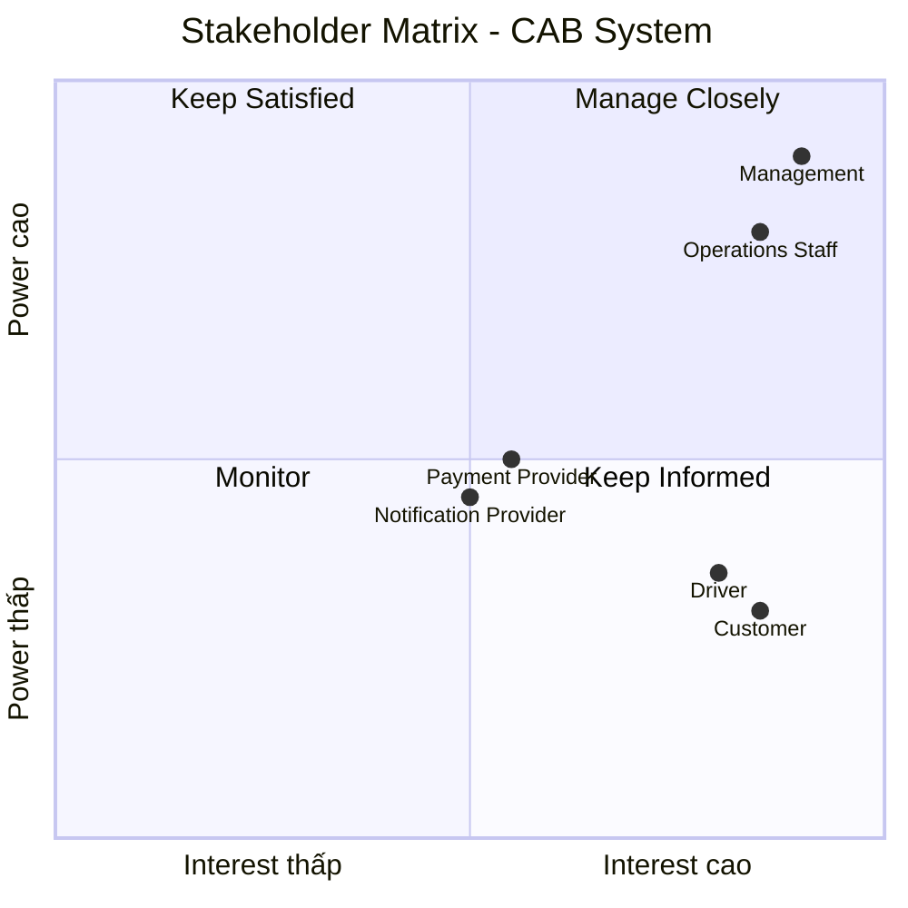

Bước 1: Đọc và phân tích yêu cầu của khách hàng ở giai đoạn sơ khởi - hiểu được business contact (ngữ cảnh của nghiệp vụ) và vấn đề của nghiệp vụ
. Business Context – Ngữ cảnh nghiệp vụ
CAB System là nền tảng đặt xe trực tuyến của công ty ABC, kết nối khách hàng – tài xế – nhân viên vận hành trong toàn bộ quy trình đặt và thực hiện chuyến xe.
Quy trình nghiệp vụ tổng quát:
Khách hàng tạo yêu cầu → Hệ thống tìm tài xế → Tài xế nhận chuyến → Thực hiện chuyến → Tính cước → Thanh toán → Đánh giá
2. Business Problem – Vấn đề nghiệp vụ
Qua yêu cầu, có thể xác định các vấn đề hiện tại của công ty ABC:
Vấn đề 1: Phân công tài xế thủ công
Việc tìm và phân công tài xế hiện chủ yếu được thực hiện thủ công.
→ Hậu quả: mất thời gian, khó xử lý khi số lượng yêu cầu tăng và dễ xảy ra sai sót.
Vấn đề 2: Khách hàng khó theo dõi chuyến đi
Khách hàng chưa có khả năng theo dõi đầy đủ:
Hệ thống đang tìm tài xế
Tài xế nào nhận chuyến
Tài xế đã đến chưa
Chuyến đang ở trạng thái nào
Chuyến đã hoàn thành hay chưa
→ Hậu quả: trải nghiệm khách hàng chưa tốt.
Vấn đề 3: Thanh toán chưa được quản lý tập trung
Thông tin và trạng thái thanh toán chưa được quản lý thống nhất.
→ Hậu quả: khó kiểm soát giao dịch, doanh thu và xử lý thanh toán thất bại.
Vấn đề 4: Khó mở rộng hệ thống
Hệ thống hiện tại khó đáp ứng khi số lượng khách hàng và tài xế tăng.
→ Hậu quả: có nguy cơ giảm hiệu năng vào giờ cao điểm.
Vấn đề 5: Khó quản lý vận hành
Nhân viên vận hành cần một nơi để:
Theo dõi chuyến đang diễn ra
Theo dõi trạng thái tài xế
Quản lý khách hàng
Quản lý tài xế
Xử lý chuyến lỗi
Tra cứu lịch sử giao dịch
Vấn đề 6: Khả năng mở rộng chức năng còn hạn chế
Doanh nghiệp muốn trong tương lai có thể:
Thêm loại dịch vụ
Thêm phương thức thanh toán
Thêm nhà cung cấp thông báo
Thay đổi thành phần kỹ thuật

Bước 2: Xác định stakeholder lập bảng gồm 2 cột gồm tên và vai trò và vẽ ma trận stakeholder cho biêt tầm ảnh hưởng của stakeholder trên hệ thống (công cụ )
Các 
Tên Stakeholder	         Vai trò
Khách hàng	             Đặt xe, theo dõi chuyến, thanh toán và đánh giá tài xế
Tài xế	                 Nhận chuyến, thực hiện chuyến và cập nhật trạng thái
Nhân viên vận hành	     Quản lý, giám sát và hỗ trợ xử lý chuyến
Bộ phận kỹ thuật/IT	     Quản lý, bảo trì và đảm bảo hệ thống hoạt động ổn định
Cổng thanh toán	         Xử lý các giao dịch thanh toán điện tử
Dịch vụ thông báo	       Gửi thông báo đến khách hàng và tài xế

