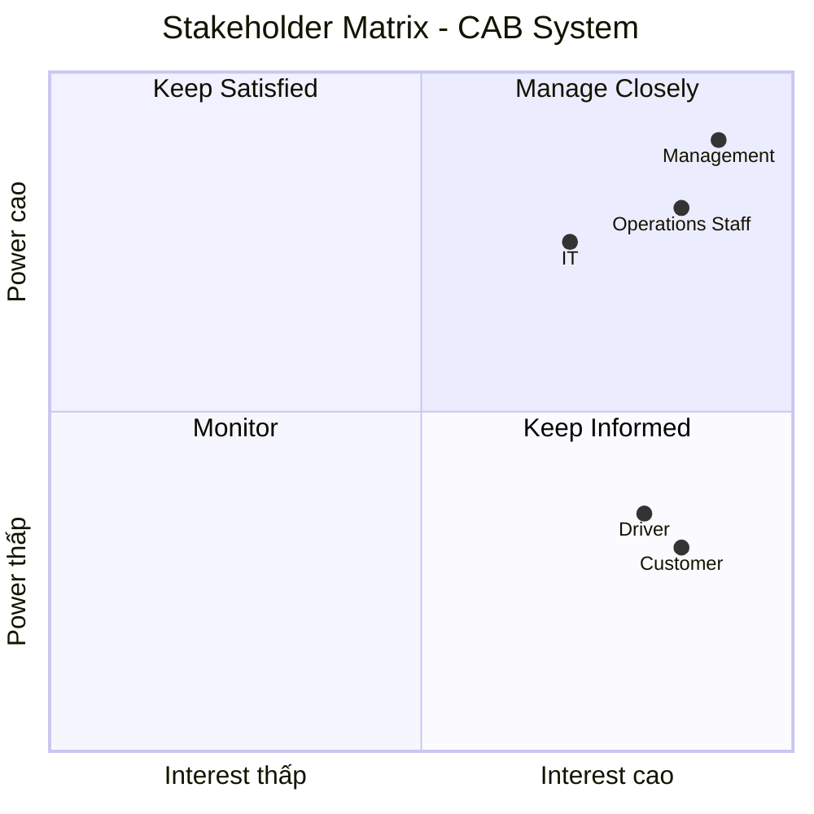
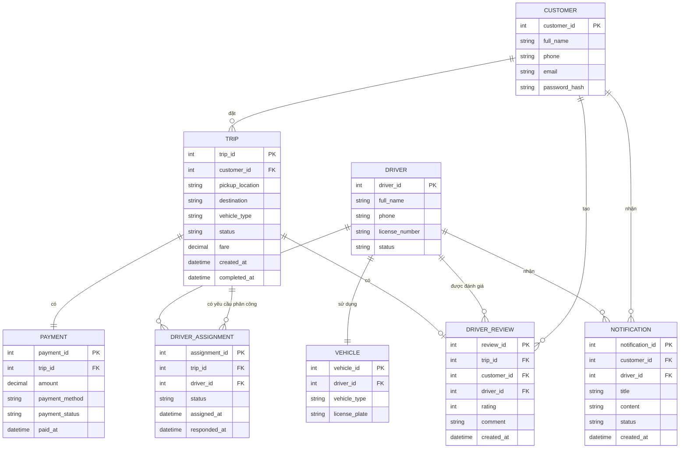

Bước 1: Đọc và phân tích yêu cầu của khách hàng ở giai đoạn sơ khởi - hiểu được business contact (ngữ cảnh của nghiệp vụ) và vấn đề của nghiệp vụ
# 1. Business Context – Ngữ cảnh nghiệp vụ

**CAB System** là nền tảng đặt xe trực tuyến của công ty **ABC**, kết nối **khách hàng – tài xế – nhân viên vận hành** trong toàn bộ quy trình đặt và thực hiện chuyến xe.

### Quy trình nghiệp vụ tổng quát

**Khách hàng tạo yêu cầu → Hệ thống tìm tài xế → Tài xế nhận chuyến → Thực hiện chuyến → Tính cước → Thanh toán → Đánh giá**

---

# 2. Business Problem – Vấn đề nghiệp vụ

Qua phân tích yêu cầu, có thể xác định các vấn đề nghiệp vụ hiện tại của công ty ABC như sau:

## Vấn đề 1: Phân công tài xế thủ công

Việc tìm kiếm và phân công tài xế hiện chủ yếu được thực hiện thủ công.

**Hậu quả:**

- Mất nhiều thời gian xử lý.
- Khó đáp ứng khi số lượng yêu cầu đặt xe tăng.
- Dễ xảy ra sai sót trong quá trình phân công.
- Khó tối ưu việc lựa chọn tài xế phù hợp.

## Vấn đề 2: Khách hàng khó theo dõi chuyến đi

Khách hàng chưa có khả năng theo dõi đầy đủ trạng thái của chuyến xe, bao gồm:

- Hệ thống đang tìm tài xế.
- Tài xế nào đã nhận chuyến.
- Tài xế đã đến điểm đón hay chưa.
- Chuyến xe đang ở trạng thái nào.
- Chuyến xe đã hoàn thành hay chưa.

**Hậu quả:**

- Khách hàng khó nắm bắt thông tin chuyến xe.
- Tăng số lượng yêu cầu hỗ trợ.
- Trải nghiệm khách hàng chưa tốt.

## Vấn đề 3: Thanh toán chưa được quản lý tập trung

Thông tin và trạng thái thanh toán chưa được quản lý thống nhất trên một hệ thống.

**Hậu quả:**

- Khó kiểm soát các giao dịch.
- Khó theo dõi doanh thu.
- Khó xử lý các giao dịch thanh toán thất bại.
- Khó tra cứu lịch sử thanh toán.

## Vấn đề 4: Khó mở rộng hệ thống

Hệ thống hiện tại khó đáp ứng khi số lượng khách hàng, tài xế và yêu cầu đặt xe tăng cao.

**Hậu quả:**

- Có nguy cơ giảm hiệu năng vào giờ cao điểm.
- Khó đáp ứng lượng truy cập lớn.
- Khó mở rộng tài nguyên khi nhu cầu tăng.

## Vấn đề 5: Khó quản lý vận hành

Nhân viên vận hành chưa có một hệ thống tập trung để quản lý và giám sát hoạt động của dịch vụ.

Hệ thống cần hỗ trợ:

- Theo dõi các chuyến xe đang diễn ra.
- Theo dõi trạng thái tài xế.
- Quản lý thông tin khách hàng.
- Quản lý thông tin tài xế.
- Xử lý các chuyến xe gặp lỗi.
- Tra cứu lịch sử chuyến xe.
- Tra cứu lịch sử giao dịch.

**Hậu quả:**

- Nhân viên vận hành mất nhiều thời gian xử lý.
- Khó giám sát toàn bộ hoạt động.
- Khó phát hiện và xử lý sự cố kịp thời.

## Vấn đề 6: Khả năng mở rộng chức năng còn hạn chế

Hệ thống hiện tại cần được thiết kế linh hoạt để đáp ứng các nhu cầu phát triển trong tương lai.

Doanh nghiệp có thể cần:

- Thêm các loại hình dịch vụ mới.
- Thêm các phương thức thanh toán mới.
- Thêm các nhà cung cấp dịch vụ thông báo.
- Thay đổi hoặc nâng cấp các thành phần kỹ thuật.
- Tích hợp thêm các dịch vụ bên ngoài.

**Hậu quả:**

- Việc thay đổi chức năng có thể mất nhiều thời gian.
- Chi phí bảo trì và phát triển hệ thống tăng.
- Khó tích hợp các dịch vụ mới trong tương lai.
## Tổng kết
Các vấn đề trên cho thấy công ty ABC cần xây dựng một **CAB System** có khả năng:
- Tự động hóa quá trình tìm kiếm và phân công tài xế.
- Cho phép khách hàng theo dõi trạng thái chuyến xe.
- Quản lý tập trung thông tin và giao dịch thanh toán.
- Hỗ trợ nhân viên vận hành giám sát toàn bộ hoạt động.
- Đảm bảo khả năng mở rộng khi số lượng người dùng tăng.
- Dễ dàng tích hợp thêm dịch vụ và công nghệ mới trong tương lai.

Bước 2: Xác định stakeholder lập bảng gồm 2 cột gồm tên và vai trò và vẽ ma trận stakeholder cho biêt tầm ảnh hưởng của stakeholder trên hệ thống (công cụ )
| Tên Stakeholder | Vai trò |
|---|---|
| Khách hàng | Đăng ký, đặt xe, theo dõi chuyến, thanh toán và đánh giá tài xế |
| Tài xế | Cập nhật hồ sơ, nhận/từ chối chuyến, thực hiện chuyến và cập nhật trạng thái |
| Nhân viên vận hành | Quản lý, giám sát và hỗ trợ xử lý khách hàng, tài xế, phương tiện và chuyến đi |
| Ban lãnh đạo / Management | Theo dõi doanh thu, số lượng chuyến, tỷ lệ hoàn thành, tỷ lệ hủy và hiệu quả hoạt động |
| Bộ phận kỹ thuật / IT | Quản lý, bảo trì, triển khai và đảm bảo hệ thống hoạt động ổn định |

Bước 3: Liệt kê các cái mục tiêu của nghiệp vụ (BG1 là gì BG2 là gì ) vd tự động tìm tài xế, hỗ trợ thanh toán mục đích cho phép thanh toán tiền mặt và thanh toán 
# 3. Business Goals – Mục tiêu nghiệp vụ

| Mã | Business Goal | Mục tiêu |
|---|---|---|
| BG01 | Tự động hóa tìm và phân công tài xế | Giảm sự phụ thuộc vào việc phân công tài xế thủ công và nâng cao hiệu quả xử lý yêu cầu đặt xe |
| BG02 | Cải thiện trải nghiệm khách hàng | Giúp khách hàng dễ dàng đặt xe, theo dõi trạng thái chuyến, thanh toán và đánh giá tài xế |
| BG03 | Quản lý thanh toán tập trung | Quản lý thông tin và trạng thái giao dịch một cách thống nhất, đồng thời hỗ trợ thanh toán điện tử |
| BG04 | Nâng cao hiệu quả vận hành | Hỗ trợ nhân viên vận hành quản lý, giám sát và xử lý các chuyến đi hiệu quả hơn |
| BG05 | Hỗ trợ quản lý phương tiện và tài xế | Cung cấp thông tin cần thiết để quản lý tài xế và phương tiện phục vụ hoạt động đặt xe |
| BG06 | Đảm bảo khả năng mở rộng hệ thống | Đảm bảo hệ thống có thể phục vụ số lượng lớn khách hàng và tài xế khi nhu cầu tăng |
| BG07 | Đảm bảo an toàn và bảo mật | Bảo vệ thông tin cá nhân, dữ liệu vị trí, dữ liệu giao dịch và kiểm soát quyền truy cập |
| BG08 | Hỗ trợ theo dõi và ra quyết định | Cung cấp dữ liệu và báo cáo về số lượng chuyến, doanh thu, tỷ lệ hoàn thành, tỷ lệ hủy và hiệu quả tài xế |
| BG09 | Tăng khả năng mở rộng dịch vụ | Cho phép doanh nghiệp bổ sung loại dịch vụ, phương thức thanh toán và kênh thông báo trong tương lai |
| BG10 | Tăng tính linh hoạt của hệ thống | Cho phép thay đổi hoặc mở rộng các thành phần kỹ thuật mà hạn chế ảnh hưởng đến các chức năng đang hoạt động |

Bước 4: Xác định phạm vi yêu cầu phải làm (score) VD: quản lí khách hàng, tài xế trong mbb phải biết làm cái gì, liệt kê ra các thứ mình phải làm và những thứ ngoài phạm vi không nên làm 
# 4. Scope – Phạm vi yêu cầu
## 4.1. Các yêu cầu phải làm (In Scope)

| STT | Phạm vi | Các nội dung cần thực hiện |
|---|---|---|
| 1 | Quản lý khách hàng | Đăng ký tài khoản, đăng nhập, cập nhật thông tin cá nhân, xem lịch sử chuyến đi |
| 2 | Quản lý tài xế | Quản lý hồ sơ tài xế, trạng thái hoạt động, nhận/từ chối chuyến, cập nhật trạng thái chuyến |
| 3 | Quản lý phương tiện | Quản lý thông tin phương tiện, loại xe, trạng thái phương tiện và liên kết phương tiện với tài xế |
| 4 | Đặt xe | Nhập điểm đón, điểm đến, chọn loại xe, gửi yêu cầu đặt xe |
| 5 | Tìm và phân công tài xế | Xác định tài xế phù hợp dựa trên vị trí, trạng thái sẵn sàng và tiêu chí vận hành; tiếp tục tìm tài xế khác khi tài xế từ chối hoặc không phản hồi |
| 6 | Theo dõi chuyến đi | Cho phép khách hàng theo dõi trạng thái yêu cầu và trạng thái chuyến đi |
| 7 | Thực hiện chuyến | Tài xế cập nhật các trạng thái như đến điểm đón, đón khách, đang di chuyển và hoàn thành chuyến |
| 8 | Tính cước | Xác định số tiền khách hàng phải trả dựa trên thông tin chuyến đi và loại dịch vụ |
| 9 | Thanh toán | Hỗ trợ thanh toán tiền mặt và thanh toán điện tử thông qua cổng thanh toán bên ngoài |
| 10 | Thông báo | Gửi thông báo về đặt xe, tài xế nhận chuyến, tài xế đến điểm đón, hoàn thành chuyến và kết quả thanh toán |
| 11 | Đánh giá tài xế | Cho phép khách hàng đánh giá tài xế sau khi hoàn thành chuyến |
| 12 | Quản lý vận hành | Nhân viên vận hành quản lý khách hàng, tài xế, phương tiện và chuyến đi; hỗ trợ xử lý các trường hợp chuyến bị lỗi |
| 13 | Báo cáo | Cung cấp báo cáo về số lượng chuyến, doanh thu, tỷ lệ hoàn thành, tỷ lệ hủy và hiệu quả hoạt động của tài xế |
| 14 | Phân quyền | Kiểm soát quyền truy cập đối với các chức năng quản trị và thao tác nhạy cảm |

## 4.2. Ngoài phạm vi (Out of Scope)

| STT | Nội dung ngoài phạm vi | Lý do |
|---|---|---|
| 1 | Xây dựng cổng thanh toán riêng | Doanh nghiệp yêu cầu tích hợp với nhà cung cấp thanh toán bên ngoài |
| 2 | Lưu thông tin nhạy cảm của thẻ hoặc tài khoản thanh toán | Doanh nghiệp không muốn dữ liệu nhạy cảm được lưu trực tiếp trong hệ thống CAB |
| 3 | Xây dựng các dịch vụ mới chưa được doanh nghiệp xác định | Chỉ yêu cầu hệ thống có khả năng mở rộng để bổ sung trong tương lai |
| 4 | Xây dựng nhà cung cấp thông báo riêng | Hệ thống chỉ cần có khả năng tích hợp với các nhà cung cấp thông báo |

Bước 5: Chuyển các yêu cầu thành bussiness requirment (mỗi bussiness requirment kí hiệu bằng BR01, BR01 là cái gì) vd br01 là đặt chuyến xe thì thiết kế bảng gồm mã, tên, diễn giải  
# Bước 5: Xác định Business Requirements

| Mã | Business Requirement | Mô tả |
|---|---|---|
| BR01 | Quản lý tài khoản khách hàng | Hệ thống phải cho phép khách hàng đăng ký, đăng nhập và cập nhật thông tin cá nhân |
| BR02 | Quản lý tài xế | Hệ thống phải cho phép doanh nghiệp quản lý thông tin và trạng thái hoạt động của tài xế |
| BR03 | Quản lý phương tiện | Hệ thống phải cho phép doanh nghiệp quản lý thông tin và trạng thái phương tiện phục vụ dịch vụ CAB |
| BR04 | Đặt xe | Hệ thống phải cho phép khách hàng tạo yêu cầu đặt xe với điểm đón, điểm đến và loại xe |
| BR05 | Tìm và phân công tài xế | Hệ thống phải hỗ trợ xác định và phân công tài xế phù hợp cho yêu cầu đặt xe |
| BR06 | Xử lý tài xế từ chối hoặc không phản hồi | Hệ thống phải tiếp tục tìm tài xế khác khi tài xế được đề xuất từ chối hoặc không phản hồi |
| BR07 | Theo dõi chuyến đi | Hệ thống phải cho phép khách hàng theo dõi trạng thái yêu cầu và chuyến đi |
| BR08 | Thực hiện chuyến xe | Hệ thống phải hỗ trợ tài xế cập nhật trạng thái trong quá trình thực hiện chuyến |
| BR09 | Lưu thông tin vị trí tài xế | Hệ thống phải lưu thông tin vị trí của tài xế để hỗ trợ tìm tài xế và dự kiến thời gian đến |
| BR10 | Tính cước | Hệ thống phải xác định số tiền khách hàng phải trả sau khi chuyến đi hoàn thành |
| BR11 | Thanh toán | Hệ thống phải hỗ trợ thanh toán tiền mặt và thanh toán điện tử thông qua nhà cung cấp bên ngoài |
| BR12 | Xử lý thanh toán thất bại | Hệ thống phải thông báo kết quả thanh toán và hỗ trợ xử lý lại giao dịch theo chính sách của doanh nghiệp |
| BR13 | Thông báo | Hệ thống phải gửi thông báo đến khách hàng và tài xế về các sự kiện liên quan đến chuyến đi và thanh toán |
| BR14 | Đánh giá tài xế | Hệ thống phải cho phép khách hàng đánh giá tài xế sau khi hoàn thành chuyến |
| BR15 | Quản lý và hỗ trợ vận hành | Hệ thống phải hỗ trợ nhân viên vận hành quản lý và giám sát khách hàng, tài xế, phương tiện và chuyến đi |
| BR16 | Phân quyền quản trị | Hệ thống phải kiểm soát quyền truy cập đối với các chức năng quản trị và thao tác nhạy cảm |
| BR17 | Báo cáo hoạt động | Hệ thống phải cung cấp báo cáo về số lượng chuyến, doanh thu, tỷ lệ hoàn thành, tỷ lệ hủy và hiệu quả hoạt động của tài xế |

Bước 6: Xây dựng các bussiness process 
# 6. Business Process – Quy trình nghiệp vụ

# Bước 6: Xác định Business Process

| Mã | Business Process | Các bước chính |
|---|---|---|
| BP01 | Quản lý tài khoản | Khách hàng/tài xế đăng ký → đăng nhập → cập nhật thông tin tài khoản |
| BP02 | Đặt xe | Khách hàng nhập điểm đón → nhập điểm đến → chọn loại xe → gửi yêu cầu đặt xe |
| BP03 | Tìm và phân công tài xế | Hệ thống tiếp nhận yêu cầu → xác định tài xế phù hợp → gửi yêu cầu → tài xế nhận hoặc từ chối → tiếp tục tìm tài xế khác nếu cần |
| BP04 | Theo dõi và thực hiện chuyến | Tài xế nhận chuyến → đến điểm đón → đón khách → thực hiện chuyến → hoàn thành chuyến |
| BP05 | Tính cước và thanh toán | Chuyến hoàn thành → xác định số tiền phải trả → khách hàng thanh toán tiền mặt hoặc điện tử → ghi nhận kết quả |
| BP06 | Thông báo | Hệ thống gửi thông báo khi đặt xe được tiếp nhận, tài xế nhận chuyến, tài xế đến điểm đón, chuyến hoàn thành và thanh toán có kết quả |
| BP07 | Đánh giá chuyến đi | Khách hàng xem thông tin chuyến → đánh giá tài xế sau khi chuyến hoàn thành |
| BP08 | Quản lý và giám sát vận hành | Nhân viên vận hành xem và quản lý khách hàng, tài xế, phương tiện, chuyến đi → hỗ trợ xử lý các trường hợp phát sinh |
| BP09 | Báo cáo hoạt động | Hệ thống tổng hợp dữ liệu → cung cấp số liệu về chuyến đi, doanh thu, tỷ lệ hoàn thành, tỷ lệ hủy và hiệu quả tài xế |

Bước 7: Thiết kế phân rả yêu cầu nghiệp vụ từ BR (mã viết tắt Funtional Requerement là FR). Ví dụ FR01: Tìm tài xế. FR02: Chọn những  tài xế online. FR03: chọn loại xe. FR04: Chọn tài xế có đánh giá cao. Lưu ý đọc vào yêu cầu có thì mới đưa vô các ví dụ chỉ là gợi ý chưa chắc có trong yêu cầu
# Bước 7: Phân rã yêu cầu nghiệp vụ thành Functional Requirements

| Mã BR | Business Requirement | Các Functional Requirements |
|---|---|---|
| BR01 | Quản lý tài khoản khách hàng | FR01: Đăng ký tài khoản FR02: Đăng nhập FR03: Cập nhật thông tin cá nhân |
| BR02 | Quản lý tài xế | FR04: Quản lý thông tin tài xế FR05: Cập nhật trạng thái hoạt động FR06: Nhận hoặc từ chối chuyến |
| BR03 | Quản lý phương tiện | FR07: Quản lý thông tin phương tiện |
| BR04 | Đặt xe | FR08: Nhập điểm đón FR09: Nhập điểm đến FR10: Chọn loại xe FR11: Gửi yêu cầu đặt xe |
| BR05 | Tìm và phân công tài xế | FR12: Tìm tài xế phù hợp FR13: Ưu tiên tài xế phù hợp và gần khách hàng |
| BR06 | Xử lý tài xế không nhận chuyến | FR14: Tiếp tục tìm tài xế khác khi tài xế từ chối hoặc không phản hồi FR15: Thông báo khi không tìm được tài xế |
| BR07 | Theo dõi chuyến đi | FR16: Theo dõi trạng thái chuyến FR17: Xem thông tin tài xế đã nhận chuyến FR18: Xem thời gian dự kiến tài xế đến |
| BR08 | Thực hiện chuyến | FR19: Cập nhật trạng thái đã đến điểm đón FR20: Cập nhật trạng thái đã đón khách FR21: Cập nhật trạng thái đang di chuyển FR22: Cập nhật trạng thái hoàn thành chuyến |
| BR09 | Quản lý vị trí tài xế | FR23: Lưu thông tin vị trí của tài xế |
| BR10 | Tính cước | FR24: Xác định số tiền khách hàng phải trả |
| BR11 | Thanh toán | FR25: Thanh toán bằng tiền mặt FR26: Thanh toán điện tử thông qua nhà cung cấp bên ngoài |
| BR12 | Xử lý thanh toán thất bại | FR27: Thông báo khi thanh toán điện tử thất bại FR28: Xử lý lại giao dịch theo chính sách của doanh nghiệp |
| BR13 | Thông báo | FR29: Thông báo khi yêu cầu đặt xe được tiếp nhận FR30: Thông báo khi tài xế nhận chuyến FR31: Thông báo khi tài xế đến điểm đón FR32: Thông báo khi chuyến hoàn thành FR33: Thông báo khi thanh toán có kết quả |
| BR14 | Lịch sử và đánh giá chuyến đi | FR34: Xem lịch sử chuyến đi FR35: Xem số tiền phải trả FR36: Đánh giá tài xế sau khi hoàn thành chuyến |
| BR15 | Quản lý và giám sát vận hành | FR37: Quản lý khách hàng FR38: Quản lý tài xế FR39: Quản lý phương tiện FR40: Quản lý chuyến đi FR41: Xem chuyến đang diễn ra FR42: Kiểm tra trạng thái tài xế FR43: Hỗ trợ xử lý chuyến bị lỗi |
| BR16 | Phân quyền và kiểm soát | FR44: Kiểm soát quyền truy cập chức năng quản trị FR45: Lưu vết các thao tác quan trọng |
| BR17 | Báo cáo hoạt động | FR46: Báo cáo số lượng chuyến FR47: Báo cáo doanh thu FR48: Báo cáo tỷ lệ chuyến hoàn thành FR49: Báo cáo tỷ lệ chuyến hủy FR50: Báo cáo hiệu quả hoạt động của tài xế |
# 8. Business Rules & Exceptions – Quy tắc và ngoại lệ nghiệp vụ

## 8.1. Business Rules – Quy tắc nghiệp vụ

| Mã | Business Rule | Diễn giải |
|---|---|---|
| **BRL01** | Chỉ tài xế Available mới được nhận chuyến | Tài xế phải ở trạng thái `Available` mới được hệ thống gửi yêu cầu và cho phép nhận chuyến. |
| **BRL02** | Một tài xế chỉ được nhận một chuyến tại một thời điểm | Tài xế đang thực hiện chuyến không được nhận thêm chuyến mới. |
| **BRL03** | Chuyến phải có tài xế mới được thực hiện | Hệ thống chỉ cho phép bắt đầu chuyến khi đã xác định tài xế. |
| **BRL04** | Chỉ chuyến đã hoàn thành mới được tính cước | Hệ thống thực hiện tính cước sau khi tài xế cập nhật chuyến hoàn thành. |
| **BRL05** | Chỉ chuyến hợp lệ mới được thanh toán | Hệ thống chỉ cho phép thanh toán đối với chuyến có cước phí hợp lệ. |
| **BRL06** | Chỉ được đánh giá sau khi chuyến hoàn thành | Khách hàng chỉ có thể đánh giá tài xế sau khi chuyến kết thúc. |
| **BRL07** | Tài xế từ chối chuyến sẽ không được phân công chuyến đó | Hệ thống chuyển sang tìm tài xế phù hợp khác. |
| **BRL08** | Mỗi chuyến chỉ được phân công một tài xế | Khi một tài xế đã nhận chuyến, hệ thống không tiếp tục phân công chuyến đó cho tài xế khác. |
| **BRL09** | Thanh toán điện tử phải được xác nhận từ cổng thanh toán | Hệ thống chỉ ghi nhận thanh toán thành công khi nhận được kết quả thành công từ cổng thanh toán. |
| **BRL10** | Tài xế phải cập nhật trạng thái theo quá trình thực hiện chuyến | Tài xế phải cập nhật các trạng thái như đã đến điểm đón, bắt đầu và hoàn thành chuyến. |

## 8.2. Exceptions – Ngoại lệ

| Mã | Exception | Cách xử lý |
|---|---|---|
| **EX01** | Không tìm được tài xế | Hệ thống tiếp tục tìm tài xế trong thời gian quy định; nếu vẫn không có thì thông báo cho khách hàng và cho phép hủy yêu cầu. |
| **EX02** | Khách hàng chờ quá lâu nhưng chưa có tài xế | Hệ thống gửi thông báo cho khách hàng về tình trạng tìm tài xế và cho phép khách hàng hủy yêu cầu. |
| **EX03** | Tài xế từ chối chuyến | Hệ thống ghi nhận từ chối và tìm tài xế phù hợp khác. |
| **EX04** | Tài xế không phản hồi | Sau thời gian chờ quy định, hệ thống chuyển yêu cầu cho tài xế khác. |
| **EX05** | Thanh toán điện tử thất bại | Hệ thống thông báo thanh toán thất bại và cho phép khách hàng thực hiện lại hoặc chọn phương thức khác. |
| **EX06** | Khách hàng hủy chuyến | Hệ thống kiểm tra trạng thái chuyến → hủy chuyến → cập nhật trạng thái và thông báo cho tài xế nếu đã được phân công. |
| **EX07** | Tài xế gặp sự cố trong chuyến | Tài xế báo sự cố → hệ thống thông báo cho nhân viên vận hành → nhân viên xử lý và cập nhật kết quả. |
| **EX08** | Hệ thống không gửi được thông báo | Hệ thống ghi nhận lỗi và thực hiện gửi lại theo cơ chế của hệ thống. |
| **EX09** | Cổng thanh toán không phản hồi | Hệ thống ghi nhận giao dịch đang chờ xử lý và không xác nhận thanh toán thành công khi chưa có kết quả. |
| **EX10** | Tài xế không thể tiếp tục chuyến | Nhân viên vận hành tiếp nhận sự cố và thực hiện phương án xử lý phù hợp. |
# 9. Data Modeling – Mô hình dữ liệu

## 9.1. Xác định thực thể

| STT | Tên thực thể | Mô tả |
|---|---|---|
| 1 | **Customer** | Lưu thông tin khách hàng sử dụng dịch vụ đặt xe. |
| 2 | **Driver** | Lưu thông tin tài xế. |
| 3 | **Vehicle** | Lưu thông tin phương tiện của tài xế. |
| 4 | **Trip** | Lưu thông tin chuyến xe do khách hàng tạo. |
| 5 | **DriverAssignment** | Lưu thông tin hệ thống đề xuất tài xế cho chuyến xe và kết quả phản hồi của tài xế. |
| 6 | **Payment** | Lưu thông tin thanh toán của chuyến xe. |
| 7 | **DriverReview** | Lưu đánh giá của khách hàng dành cho tài xế sau chuyến đi. |
| 8 | **Notification** | Lưu thông tin các thông báo được gửi đến khách hàng hoặc tài xế. |

## 9.2. Thuộc tính của các thực thể

| Thực thể | Thuộc tính |
|---|---|
| **Customer** | customer_id (PK), full_name, phone, email, password |
| **Driver** | driver_id (PK), full_name, phone, license_number, status |
| **Vehicle** | vehicle_id (PK), driver_id (FK), vehicle_type, license_plate |
| **Trip** | trip_id (PK), customer_id (FK), pickup_location, destination, vehicle_type, status, fare, created_at, completed_at |
| **DriverAssignment** | assignment_id (PK), trip_id (FK), driver_id (FK), status, assigned_at, responded_at |
| **Payment** | payment_id (PK), trip_id (FK), amount, payment_method, payment_status, paid_at |
| **DriverReview** | review_id (PK), trip_id (FK), customer_id (FK), driver_id (FK), rating, comment, created_at |
| **Notification** | notification_id (PK), customer_id (FK), driver_id (FK), title, content, status, created_at |

## 9.3. Quan hệ giữa các thực thể

| Quan hệ | Bội số |
|---|---|
| Customer – Trip | 1 : N |
| Driver – Vehicle | 1 : 1* |
| Trip – DriverAssignment | 1 : N |
| Driver – DriverAssignment | 1 : N |
| Trip – Payment | 1 : 1 |
| Customer – DriverReview | 1 : N |
| Driver – DriverReview | 1 : N |
| Trip – DriverReview | 1 : 0..1 |
| Customer – Notification | 1 : N |
| Driver – Notification | 1 : N |

Bước 10: Xác định các yêu cầu phi chức năng 
## Yêu cầu phi chức năng

| Mã | Nhóm | Yêu cầu phi chức năng |
|---|---|---|
| NFR-01 | Tính ổn định | Hệ thống phải hoạt động ổn định vào các thời điểm nhu cầu đặt xe tăng cao. |
| NFR-02 | Cô lập lỗi | Lỗi xảy ra ở chức năng thanh toán hoặc thông báo không được làm cho toàn bộ hệ thống đặt xe ngừng hoạt động. |
| NFR-03 | Khả năng mở rộng | Các thành phần của hệ thống phải có khả năng mở rộng độc lập khi tải tăng. |
| NFR-04 | Khả năng triển khai | Các chức năng mới có thể được triển khai từng phần và hạn chế ảnh hưởng đến các chức năng đang hoạt động. |
| NFR-05 | Xác thực | Khách hàng và tài xế phải được xác thực trước khi sử dụng các chức năng yêu cầu tài khoản. |
| NFR-06 | Phân quyền | Các thao tác quản trị phải được kiểm soát quyền truy cập theo vai trò người dùng. |
| NFR-07 | Bảo vệ dữ liệu | Thông tin cá nhân, thông tin phương tiện, dữ liệu vị trí và dữ liệu giao dịch phải được bảo vệ. |
| NFR-08 | Theo dõi và lưu vết | Hệ thống phải lưu vết các thao tác quan trọng để phục vụ kiểm tra và xử lý khi có sự cố. |
| NFR-09 | Khả năng mở rộng chức năng | Kiến trúc phải đủ linh hoạt để có thể bổ sung các loại dịch vụ mới trong tương lai. |
| NFR-10 | Mở rộng thanh toán | Có thể thêm các phương thức thanh toán mới mà không phải xây dựng lại toàn bộ hệ thống. |
| NFR-11 | Mở rộng thông báo | Có thể thêm nhà cung cấp dịch vụ thông báo mới mà không phải thay đổi toàn bộ hệ thống. |
| NFR-12 | Linh hoạt công nghệ | Có thể thay đổi một số thành phần kỹ thuật mà không phải xây dựng lại toàn bộ hệ thống. |

Bước 11: vẽ và xác định các usecase(vd UC01 tên là customer ) xác định xem có bao nhiêu usecase 

# 11. Use Case – Xác định các Use Case
| Mã | Tên Use Case | Tác nhân chính |
|---|---|---|
| **UC01** | Đăng ký tài khoản | Khách hàng |
| **UC02** | Đăng nhập | Khách hàng, Tài xế |
| **UC03** | Cập nhật thông tin cá nhân | Khách hàng, Tài xế |
| **UC04** | Quản lý phương tiện | Tài xế, Nhân viên vận hành |
| **UC05** | Đặt chuyến xe | Khách hàng |
| **UC06** | Nhận hoặc từ chối chuyến | Tài xế |
| **UC07** | Theo dõi chuyến xe | Khách hàng |
| **UC08** | Cập nhật trạng thái chuyến | Tài xế |
| **UC09** | Thanh toán chuyến xe | Khách hàng, Cổng thanh toán |
| **UC10** | Xử lý thanh toán thất bại | Khách hàng, Cổng thanh toán |
| **UC11** | Xem lịch sử chuyến xe | Khách hàng |
| **UC12** | Đánh giá tài xế | Khách hàng |
| **UC13** | Quản lý khách hàng | Nhân viên vận hành |
| **UC14** | Quản lý tài xế | Nhân viên vận hành |
| **UC15** | Quản lý chuyến xe | Nhân viên vận hành |
| **UC16** | Giám sát và xử lý sự cố chuyến xe | Nhân viên vận hành |
| **UC17** | Xem báo cáo hoạt động | Nhân viên vận hành |

## 11.1. Actors

| Mã | Actor | Vai trò |
|---|---|---|
| **A01** | Khách hàng | Đặt xe, theo dõi chuyến, thanh toán và đánh giá tài xế. |
| **A02** | Tài xế | Nhận chuyến, thực hiện chuyến và cập nhật trạng thái. |
| **A03** | Nhân viên vận hành | Quản lý và giám sát chuyến, khách hàng, tài xế và xử lý sự cố. |
| **A04** | Cổng thanh toán | Xử lý giao dịch thanh toán điện tử. |
| **A05** | Dịch vụ thông báo | Gửi thông báo đến khách hàng và tài xế. |

## 11. Use Case Diagram

Bước 12: Đặc tả usecase 
# 12. Đặc tả Use Case

## UC01 – Đặt chuyến xe

| Thành phần | Nội dung |
|---|---|
| **Mã Use Case** | UC01 |
| **Tên Use Case** | Đặt chuyến xe |
| **Tác nhân** | Khách hàng |
| **Mục đích** | Cho phép khách hàng tạo yêu cầu đặt chuyến xe. |
| **Điều kiện trước** | Khách hàng đã đăng nhập và hệ thống đang hoạt động. |
| **Điều kiện sau** | Yêu cầu đặt chuyến được tạo và chuyển sang bước tìm tài xế. |
| **Luồng chính** | 1. Khách hàng nhập điểm đón. 2. Khách hàng nhập điểm đến. 3. Khách hàng chọn thời gian đón. 4. Hệ thống kiểm tra thông tin. 5. Khách hàng xác nhận đặt chuyến. 6. Hệ thống tạo yêu cầu đặt chuyến. 7. Hệ thống chuyển yêu cầu sang chức năng tìm tài xế. |
| **Luồng ngoại lệ** | Nếu thông tin không hợp lệ → hệ thống yêu cầu khách hàng nhập lại. Nếu hệ thống không thể tạo yêu cầu → thông báo lỗi cho khách hàng. |

## UC02 – Theo dõi chuyến xe

| Thành phần | Nội dung |
|---|---|
| **Mã Use Case** | UC02 |
| **Tên Use Case** | Theo dõi chuyến xe |
| **Tác nhân** | Khách hàng |
| **Mục đích** | Cho phép khách hàng theo dõi trạng thái chuyến và thông tin tài xế. |
| **Điều kiện trước** | Khách hàng có chuyến xe đang hoạt động. |
| **Điều kiện sau** | Thông tin và trạng thái chuyến được hiển thị. |
| **Luồng chính** | 1. Khách hàng mở chuyến xe. 2. Hệ thống lấy thông tin chuyến. 3. Hệ thống hiển thị trạng thái chuyến. 4. Nếu đã có tài xế, hệ thống hiển thị thông tin tài xế. 5. Hệ thống cập nhật trạng thái trong quá trình thực hiện chuyến. |
| **Luồng ngoại lệ** | Nếu không có thông tin chuyến → thông báo không tìm thấy chuyến. Nếu không có tài xế → hiển thị trạng thái đang tìm tài xế. |
## UC03 – Hủy chuyến xe

| Thành phần | Nội dung |
|---|---|
| **Mã Use Case** | UC03 |
| **Tên Use Case** | Hủy chuyến xe |
| **Tác nhân** | Khách hàng |
| **Mục đích** | Cho phép khách hàng hủy chuyến theo điều kiện nghiệp vụ. |
| **Điều kiện trước** | Chuyến xe đang ở trạng thái có thể hủy. |
| **Điều kiện sau** | Chuyến xe được cập nhật trạng thái hủy. |
| **Luồng chính** | 1. Khách hàng chọn chuyến cần hủy. 2. Hệ thống kiểm tra trạng thái chuyến. 3. Khách hàng xác nhận hủy. 4. Hệ thống cập nhật chuyến thành đã hủy. 5. Hệ thống thông báo kết quả. |
| **Luồng ngoại lệ** | Nếu chuyến không thể hủy → hệ thống thông báo và không thực hiện hủy. |
## UC04 – Đánh giá tài xế

| Thành phần | Nội dung |
|---|---|
| **Mã Use Case** | UC04 |
| **Tên Use Case** | Đánh giá tài xế |
| **Tác nhân** | Khách hàng |
| **Mục đích** | Cho phép khách hàng đánh giá tài xế sau chuyến đi. |
| **Điều kiện trước** | Chuyến xe đã hoàn thành. |
| **Điều kiện sau** | Đánh giá được lưu vào hệ thống. |
| **Luồng chính** | 1. Khách hàng mở chuyến đã hoàn thành. 2. Chọn chức năng đánh giá. 3. Chọn mức điểm đánh giá. 4. Nhập nhận xét nếu có. 5. Gửi đánh giá. 6. Hệ thống lưu đánh giá. |
| **Luồng ngoại lệ** | Nếu chuyến chưa hoàn thành → không cho phép đánh giá. Nếu đánh giá không hợp lệ → yêu cầu nhập lại. |

## UC05 – Nhận chuyến xe

| Thành phần | Nội dung |
|---|---|
| **Mã Use Case** | UC05 |
| **Tên Use Case** | Nhận chuyến xe |
| **Tác nhân** | Tài xế |
| **Mục đích** | Cho phép tài xế nhận chuyến được hệ thống phân công. |
| **Điều kiện trước** | Tài xế đang ở trạng thái Available và có yêu cầu chuyến. |
| **Điều kiện sau** | Chuyến được phân công cho tài xế. |
| **Luồng chính** | 1. Tài xế nhận yêu cầu chuyến. 2. Xem thông tin chuyến. 3. Chọn nhận chuyến. 4. Hệ thống kiểm tra trạng thái tài xế. 5. Hệ thống xác nhận tài xế nhận chuyến. 6. Thông báo cho khách hàng. |
| **Luồng ngoại lệ** | Nếu tài xế đã nhận chuyến khác → không cho phép nhận. Nếu chuyến đã được tài xế khác nhận → thông báo chuyến không còn khả dụng. |

## UC06 – Cập nhật trạng thái chuyến

| Thành phần | Nội dung |
|---|---|
| **Mã Use Case** | UC06 |
| **Tên Use Case** | Cập nhật trạng thái chuyến |
| **Tác nhân** | Tài xế |
| **Mục đích** | Cho phép tài xế cập nhật trạng thái trong quá trình thực hiện chuyến. |
| **Điều kiện trước** | Tài xế đã được phân công chuyến. |
| **Điều kiện sau** | Trạng thái chuyến được cập nhật. |
| **Luồng chính** | 1. Tài xế mở chuyến. 2. Cập nhật đã đến điểm đón. 3. Bắt đầu chuyến. 4. Thực hiện chuyến. 5. Cập nhật hoàn thành chuyến. 6. Hệ thống lưu trạng thái. |
| **Luồng ngoại lệ** | Nếu trạng thái không hợp lệ → hệ thống không cho cập nhật và thông báo lỗi. |

## UC07 – Thực hiện chuyến xe

| Thành phần | Nội dung |
|---|---|
| **Mã Use Case** | UC07 |
| **Tên Use Case** | Thực hiện chuyến xe |
| **Tác nhân** | Tài xế |
| **Mục đích** | Cho phép tài xế thực hiện chuyến từ điểm đón đến điểm đến. |
| **Điều kiện trước** | Tài xế đã nhận chuyến. |
| **Điều kiện sau** | Chuyến được cập nhật hoàn thành hoặc xử lý sự cố. |
| **Luồng chính** | 1. Tài xế di chuyển đến điểm đón. 2. Cập nhật đã đến. 3. Đón khách. 4. Bắt đầu chuyến. 5. Di chuyển đến điểm đến. 6. Kết thúc chuyến. |
| **Luồng ngoại lệ** | Nếu xảy ra sự cố → tài xế báo sự cố và nhân viên vận hành tiếp nhận xử lý. |
## UC08 – Thanh toán chuyến xe

| Thành phần | Nội dung |
|---|---|
| **Mã Use Case** | UC08 |
| **Tên Use Case** | Thanh toán chuyến xe |
| **Tác nhân** | Khách hàng, Cổng thanh toán |
| **Mục đích** | Cho phép khách hàng thanh toán tiền chuyến xe. |
| **Điều kiện trước** | Chuyến đã hoàn thành và có cước phí. |
| **Điều kiện sau** | Thanh toán được ghi nhận thành công hoặc thất bại. |
| **Luồng chính** | 1. Hệ thống hiển thị số tiền cần thanh toán. 2. Khách hàng chọn phương thức thanh toán. 3. Nếu tiền mặt → thanh toán cho tài xế và tài xế xác nhận. 4. Nếu điện tử → hệ thống gửi giao dịch đến cổng thanh toán. 5. Nhận kết quả giao dịch. 6. Cập nhật trạng thái thanh toán. |
| **Luồng ngoại lệ** | Nếu thanh toán điện tử thất bại → thông báo lỗi và cho phép thanh toán lại hoặc chọn phương thức khác. |
## UC09 – Tìm và phân công tài xế

| Thành phần | Nội dung |
|---|---|
| **Mã Use Case** | UC09 |
| **Tên Use Case** | Tìm và phân công tài xế |
| **Tác nhân** | Hệ thống, Tài xế |
| **Mục đích** | Tự động tìm tài xế phù hợp cho yêu cầu đặt chuyến. |
| **Điều kiện trước** | Có yêu cầu đặt chuyến chưa được phân công. |
| **Điều kiện sau** | Chuyến được phân công cho tài xế hoặc thông báo không tìm được tài xế. |
| **Luồng chính** | 1. Hệ thống nhận yêu cầu đặt chuyến. 2. Tìm tài xế đang Available. 3. Ưu tiên tài xế phù hợp. 4. Gửi yêu cầu nhận chuyến. 5. Tài xế nhận chuyến. 6. Hệ thống xác nhận phân công. 7. Thông báo cho khách hàng. |
| **Luồng ngoại lệ** | Tài xế từ chối/không phản hồi → tìm tài xế khác. Không còn tài xế phù hợp → thông báo cho khách hàng. |

Bước 13: Những tiêu chí chấp nhận (AC) là tập hợp các điều kiện tính năng phải đáp ứng để giúp ng làm phần mềm xác định khi nào yêu cầu kết thúc và nghệm thu> Hãy thiết kế ra các AC
## 13. Acceptance Criteria – Tiêu chí chấp nhận

| Mã AC | Tính năng | Tiêu chí chấp nhận |
|---|---|---|
| **AC01** | Đặt chuyến xe | Khi khách hàng nhập đầy đủ điểm đón, điểm đến và thời gian đón hợp lệ, hệ thống phải cho phép xác nhận và tạo chuyến xe thành công. |
| **AC02** | Kiểm tra thông tin | Khi khách hàng nhập thiếu hoặc sai thông tin đặt chuyến, hệ thống phải hiển thị thông báo lỗi và không tạo chuyến. |
| **AC03** | Hủy chuyến | Khi chuyến đang ở trạng thái cho phép hủy, khách hàng xác nhận hủy thì hệ thống phải cập nhật chuyến thành trạng thái đã hủy. |
| **AC04** | Tìm tài xế | Khi có yêu cầu đặt xe, hệ thống phải tự động tìm các tài xế đang Available và phù hợp với yêu cầu chuyến xe. |
| **AC05** | Nhận chuyến | Khi tài xế đang Available và nhận yêu cầu trong thời gian quy định, hệ thống phải xác nhận tài xế nhận chuyến thành công. |
| **AC06** | Phân công tài xế | Khi tài xế nhận chuyến, hệ thống phải ghi nhận tài xế được phân công và thông báo thông tin tài xế cho khách hàng. |
| **AC07** | Không tìm được tài xế | Khi hệ thống không tìm được tài xế phù hợp sau thời gian quy định, hệ thống phải thông báo cho khách hàng và cập nhật trạng thái yêu cầu. |
| **AC08** | Theo dõi chuyến | Khi chuyến đang hoạt động, khách hàng phải xem được trạng thái hiện tại và thông tin tài xế được phân công. |
| **AC09** | Thực hiện chuyến | Tài xế phải có thể cập nhật lần lượt các trạng thái nhận chuyến, đã đến điểm đón, bắt đầu chuyến và hoàn thành chuyến. |
| **AC10** | Tính cước | Khi chuyến được cập nhật hoàn thành, hệ thống phải tự động tính cước theo thông tin chuyến và quy định giá hiện hành. |
| **AC11** | Thanh toán | Sau khi có cước phí, khách hàng phải có thể lựa chọn thanh toán bằng tiền mặt hoặc phương thức thanh toán điện tử. |
| **AC12** | Thanh toán thất bại | Khi giao dịch điện tử thất bại, hệ thống phải ghi nhận trạng thái thất bại, thông báo cho khách hàng và cho phép thực hiện thanh toán lại. |
| **AC13** | Quản lý khách hàng | Nhân viên vận hành phải có thể thêm, xem, cập nhật và tìm kiếm thông tin khách hàng trong hệ thống. |
| **AC14** | Quản lý tài xế | Nhân viên vận hành phải có thể thêm, xem, cập nhật thông tin và theo dõi trạng thái hoạt động của tài xế. |
| **AC15** | Quản lý vận hành | Nhân viên vận hành phải có thể theo dõi các chuyến xe đang diễn ra, phát hiện và ghi nhận kết quả xử lý sự cố. |
| **AC16** | Thông báo | Khi phát sinh các sự kiện như đặt xe, nhận chuyến, thay đổi trạng thái hoặc thanh toán, hệ thống phải gửi thông báo đến đúng đối tượng. |
| **AC17** | Đánh giá tài xế | Sau khi chuyến hoàn thành, khách hàng phải có thể đánh giá tài xế bằng điểm đánh giá và nhận xét. |
| **AC18** | Tra cứu lịch sử | Nhân viên vận hành phải có thể tra cứu lịch sử chuyến xe và các giao dịch thanh toán đã phát sinh. |
| **AC19** | Phân quyền | Người dùng chỉ được truy cập và thực hiện các chức năng phù hợp với vai trò và quyền hạn được cấp. |
| **AC20** | Khả năng mở rộng | Hệ thống phải cho phép tích hợp thêm phương thức thanh toán, dịch vụ thông báo hoặc loại dịch vụ mới mà không phải thay đổi toàn bộ hệ thống. |

Bước 14: Truy xuất nguồn gốc yêu cầu - quá trình theo dõi yêu cầu bắt dâu khi nào thiết kế thế nào cho tới biết kiểm thử. Bảng RTM (Ma trận truy xuất yêu cầu trong bảng sẽ có các cột: MÃ business goal, mã BR, mã FR, UC, AC, TC-testcase)
# 14. Requirements Traceability Matrix – RTM

| BC | BR | FR | UC | AC |
|---|---|---|---|---|
| Phân công tài xế thủ công | **BR01** – Đặt chuyến xe | FR01–FR05 – Nhập thông tin và tạo chuyến | **UC01** – Đặt chuyến xe | **AC01, AC02** |
| Phân công tài xế thủ công | **BR03** – Tự động tìm tài xế | FR09–FR16 – Tìm và gửi yêu cầu nhận chuyến | **UC09** – Tìm và phân công tài xế | **AC04, AC05, AC07** |
| Khó theo dõi chuyến đi | **BR07** – Theo dõi trạng thái chuyến | FR29–FR31 – Xem và cập nhật trạng thái | **UC02** – Theo dõi chuyến xe | **AC08** |
| Khó theo dõi chuyến đi | **BR08** – Thực hiện chuyến xe | FR32–FR34 – Cập nhật trạng thái chuyến | **UC07** – Thực hiện chuyến xe | **AC09** |
| Thanh toán chưa tập trung | **BR09** – Tính cước chuyến xe | FR35–FR36 – Tính và hiển thị cước | **UC10** – Tính cước chuyến xe | **AC10** |
| Thanh toán chưa tập trung | **BR10** – Thanh toán chuyến xe | FR37–FR40 – Chọn và xử lý thanh toán | **UC08** – Thanh toán chuyến xe | **AC11, AC12** |
| Khó quản lý vận hành | **BR05** – Quản lý tài xế | FR19–FR23 – Quản lý thông tin và trạng thái tài xế | **UC13** – Quản lý tài xế | **AC14** |
| Khó quản lý vận hành | **BR06** – Quản lý khách hàng | FR24–FR28 – Quản lý thông tin khách hàng | **UC12** – Quản lý khách hàng | **AC13** |
| Khó quản lý vận hành | **BR13** – Quản lý và giám sát vận hành | FR41–FR43 – Theo dõi và xử lý sự cố | **UC14** – Quản lý vận hành | **AC15** |
| Khó theo dõi thông tin | **BR12** – Gửi thông báo | FR44–FR47 – Gửi thông báo | **UC11** – Gửi thông báo | **AC16** |
| Cải thiện trải nghiệm khách hàng | **BR15** – Đánh giá tài xế | FR48–FR50 – Đánh giá và nhận xét | **UC04** – Đánh giá tài xế | **AC17** |
| Khó quản lý vận hành | **BR14** – Quản lý lịch sử | FR51–FR52 – Tra cứu lịch sử | **UC16** – Tra cứu giao dịch | **AC18** |
| Khó quản lý vận hành | **BR16** – Quản lý tài khoản và phân quyền | FR53–FR54 – Quản lý quyền truy cập | **UC20** – Quản lý tài khoản và phân quyền | **AC19** |
| Khó mở rộng hệ thống | **BR17** – Tích hợp dịch vụ bên ngoài | FR55–FR56 – Tích hợp thanh toán và thông báo | **UC18** – Xử lý giao dịch thanh toán | **AC20** |
| Khó mở rộng hệ thống | **BR18** – Khả năng mở rộng hệ thống | FR57–FR59 – Mở rộng dịch vụ và phương thức thanh toán | **UC18** – Xử lý giao dịch thanh toán | **AC20** |
